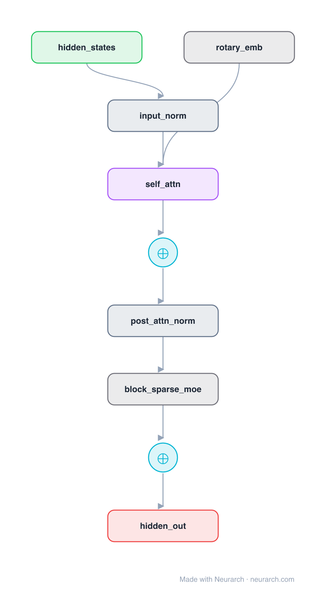
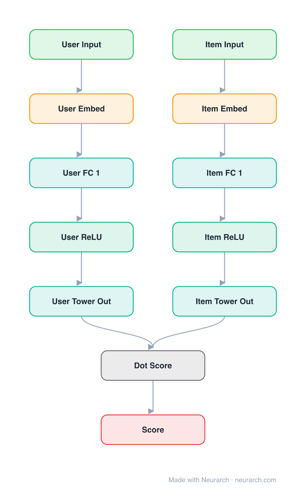

<div align="center">

# 🧠 Neurarch Model Zoo

### 42 reference architectures you can actually open, edit, validate, and train. Not pictures. Graphs.

[](#catalog)
[](#every-entry-is-validated)
[](#catalog)
[](LICENSE)
[](CONTRIBUTING.md)

**[Browse the catalog](#catalog)** · **[Open one in your browser](#open-any-architecture-in-one-click)** · **[Contribute](CONTRIBUTING.md)**

</div>

---

Every diagram of Qwen or Mixtral you have ever seen is a dead image. The entries here are live, structurally validated model graphs:

- **Shape-checked end to end**: tensor shapes, attention head divisibility, GQA constraints. All 42 graphs pass with zero errors.
- **Verified numbers**: LLM hyperparameters are taken from each model's official `config.json`, not from blog posts.
- **One click to editable**: every entry opens straight onto the [Neurarch](https://www.neurarch.com/) canvas, where you can fork it, swap the attention, and re-validate before you ever launch a run.
- **Exportable to runnable training code**: TRL, torchtune, Unsloth, plain PyTorch.

## A few of the graphs

<table>
<tr>
<td align="center"><b><a href="architectures/qwen2.5-7b/">Qwen2.5-7B</a></b><br/><sub>GQA 28:4 · RoPE · SwiGLU</sub></td>
<td align="center"><b><a href="architectures/whisper-small/">Whisper Small</a></b><br/><sub>audio conv stem · enc-dec</sub></td>
<td align="center"><b><a href="architectures/mixtral-block/">Mixtral MoE Block</a></b><br/><sub>8 experts · top-2 routing</sub></td>
<td align="center"><b><a href="architectures/two-tower/">Two-Tower</a></b><br/><sub>dual encoder · dot product</sub></td>
</tr>
<tr>
<td></td>
<td></td>
<td></td>
<td></td>
</tr>
</table>

Want the heavy stuff? The full [ResNet-50](architectures/resnet-50/) is a 50-node graph with every bottleneck block expanded, and [VGG-16](architectures/vgg-16/) carries all 138M parameters' worth of layers.

## Open any architecture in one click

Every entry has an **Open in Neurarch** link that loads its graph straight onto the canvas, no download step:

```
https://www.neurarch.com/?import=https://raw.githubusercontent.com/neurarch-ai/neurarch-model-zoo/main/architectures/<id>/model.json
```

From there you have a live, validated graph you can fork, edit, re-validate, or export to training code.

Each folder under [`architectures/`](architectures/) contains:

| File | What it is |
|------|------------|
| `README.md` | What the model is, its **model URLs** (Neurarch, Hugging Face, GitHub, paper), verified hyperparameters, and design notes. |
| `model.json` | The Neurarch graph. |
| `assets/diagram.svg` | Vector diagram (papers, slides). |
| `assets/diagram.png` | Raster diagram (renders everywhere). |

## Catalog

### 🇨🇳 Chinese LLMs

Selection informed by [awesome-pretrained-chinese-nlp-models](https://github.com/lonePatient/awesome-pretrained-chinese-nlp-models). Hyperparameters verified against each official `config.json`.

| Architecture | Org | Params | Attention | Notable |
|--------------|-----|--------|-----------|---------|
| [qwen2.5-7b](architectures/qwen2.5-7b/) | Alibaba Cloud | 7.6B | GQA 28:4 | QKV bias, 128K context |
| [deepseek-llm-7b](architectures/deepseek-llm-7b/) | DeepSeek | 7B | MHA 32 | Dense ancestor of the DeepSeek line |
| [chatglm3-6b](architectures/chatglm3-6b/) | Zhipu AI / THUDM | 6.2B | GQA 32:2 | Near-multi-query attention, partial RoPE |
| [baichuan2-7b](architectures/baichuan2-7b/) | Baichuan Inc. | 7B | MHA 32 | NormHead, 125K Chinese vocab |
| [yi-6b](architectures/yi-6b/) | 01.AI | 6B | GQA 32:4 | Llama-compatible, 200K-context variant |
| [internlm2-7b](architectures/internlm2-7b/) | Shanghai AI Lab | 7.7B | GQA 32:8 | Native 32K context |
| [minicpm-2b](architectures/minicpm-2b/) | OpenBMB / ModelBest | 2.4B | MHA 36 | Deep-and-thin, muP-style scaling |
| [skywork-13b](architectures/skywork-13b/) | Kunlun Tech | 13B | MHA 36 | 52-layer deep-and-thin, ablated in tech report |

### 🌍 LLM classics and building blocks

| Architecture | Org | Params | Notable |
|--------------|-----|--------|---------|
| [llama3-8b](architectures/llama3-8b/) | Meta | 8B | The baseline everything else is a delta against |
| [mistral-7b](architectures/mistral-7b/) | Mistral AI | 7.2B | Sliding-window + GQA |
| [gpt2-small](architectures/gpt2-small/) | OpenAI | 124M | The reference decoder-only transformer |
| [llama3-block](architectures/llama3-block/) | Meta | block | One Llama-3 decoder block, every op expanded |
| [mixtral-block](architectures/mixtral-block/) | Mistral AI | block | Sparse MoE: 8 experts, top-2 routing |
| [mamba-block](architectures/mamba-block/) | Gu and Dao | block | Selective SSM, no attention, O(T) |
| [phi3-mini](architectures/phi3-mini/) | Microsoft | block | 3.8B-class compact decoder block |
| [transformer-block](architectures/transformer-block/) | Vaswani et al. | block | The original 2017 post-norm encoder block |

### 📝 NLP encoders and seq2seq

| Architecture | Org | Params | Notable |
|--------------|-----|--------|---------|
| [bert-base](architectures/bert-base/) | Google | 110M | The encoder that started transfer learning in NLP |
| [chinese-roberta-wwm-ext](architectures/chinese-roberta-wwm-ext/) | HFL | 102M | The standard Chinese encoder baseline |
| [ernie-3.0-base-zh](architectures/ernie-3.0-base-zh/) | Baidu | 118M | 40K vocab, 2048 positions, knowledge-enhanced |
| [t5-small](architectures/t5-small/) | Google | 60M | Text-to-text encoder-decoder, full two-stream graph |
| [simple-rnn](architectures/simple-rnn/) | Elman lineage | starter | The smallest sequential model in the zoo |

### 👁️ Computer vision

| Architecture | Org | Params | Notable |
|--------------|-----|--------|---------|
| [resnet-50](architectures/resnet-50/) | Microsoft Research | 25.6M | Full 50-node graph, every bottleneck expanded |
| [vgg-16](architectures/vgg-16/) | Oxford VGG | 138M | Depth + uniform 3x3 convs |
| [vit-b16](architectures/vit-b16/) | Google | 86M | Patch embedding + Transformer encoder |
| [unet](architectures/unet/) | Ronneberger et al. | 31M | Encoder-decoder with skip connections |
| [resnet-block](architectures/resnet-block/) | He et al. | block | The residual unit itself |
| [simple-cnn](architectures/simple-cnn/) | LeNet lineage | starter | The hello-world of computer vision |

### 🎨 Generative

| Architecture | Org | Params | Notable |
|--------------|-----|--------|---------|
| [diffusion-unet](architectures/diffusion-unet/) | CompVis / Stability | ~860M | Stable-Diffusion latent UNet with text cross-attention |

### 🎙️ Audio and speech

| Architecture | Org | Params | Notable |
|--------------|-----|--------|---------|
| [whisper-small](architectures/whisper-small/) | OpenAI | 244M | Mel spectrogram, conv stem, enc-dec with cross-attention |

### 🛒 Recommendation and ranking

| Architecture | Org | Notable |
|--------------|-----|---------|
| [two-tower](architectures/two-tower/) | Google lineage | The retrieval architecture behind almost every recommender |
| [wide-and-deep](architectures/wide-and-deep/) | Google | Memorization + generalization, joint trained |
| [dlrm](architectures/dlrm/) | Meta | Dense MLP + embeddings + pairwise interactions |
| [ncf](architectures/ncf/) | He et al. | Concat-then-MLP collaborative filtering |
| [neumf](architectures/neumf/) | He et al. | GMF + MLP fused, the full NCF model |
| [lightgcn](architectures/lightgcn/) | He et al. | Graph convolution stripped to pure propagation |
| [graph-sage-rec](architectures/graph-sage-rec/) | Stanford | Inductive sample-and-aggregate embeddings |
| [bst](architectures/bst/) | Alibaba | Transformer over user behavior sequences |
| [sli-rec](architectures/sli-rec/) | Microsoft Research | Time-aware LSTM + long-term attentive fusion |

### 📈 Time series and biosignals

| Architecture | Org | Notable |
|--------------|-----|---------|
| [patch-tst](architectures/patch-tst/) | Nie et al. | Patching + channel independence for forecasting |
| [cnn-lstm-1d](architectures/cnn-lstm-1d/) | standard baseline | Conv1D front-end + LSTM for ECG/PPG/IMU |
| [eegnet](architectures/eegnet/) | ARL | The universal EEG/BCI baseline, ~2.6K params |
| [eeg-conformer](architectures/eeg-conformer/) | Song et al. | Conv stem + Transformer for EEG decoding |

## Every entry is validated

This zoo has one bar, and it is not "looks right":

1. Every graph passes Neurarch's shape propagation with **zero errors** (the generator script fails the build otherwise).
2. Every full LLM entry's hyperparameters are pulled from the model's **official `config.json`**, with quirks (Qwen's QKV bias, Baichuan's NormHead, ChatGLM's 2 KV groups) called out in the entry README instead of papered over.
3. Every entry **exports to runnable training code** from the Neurarch canvas.

That bar caught real drift while building this repo: a widely copied Llama-3 block diagram carrying Llama-2's FFN size (11008 instead of 14336), and a "RoBERTa" checkpoint that is architecturally BERT. Validated graphs make those errors visible.

## Contributing

Designed an architecture in Neurarch you think others would find useful? See [CONTRIBUTING.md](CONTRIBUTING.md). The bar is the same as above: validate cleanly, export to runnable code, document the design choices.

## License

MIT. See [LICENSE](LICENSE). Use the architectures freely, attribution appreciated. Model weights referenced by entries remain under their upstream licenses (noted per entry).

---

<div align="center">

**If a graph here saved you a paper-reading session, [⭐ star the repo](https://github.com/neurarch-ai/neurarch-model-zoo) so the next person finds it.**

Built with [Neurarch](https://www.neurarch.com/), a graph-native design environment for ML model architectures.

</div>
