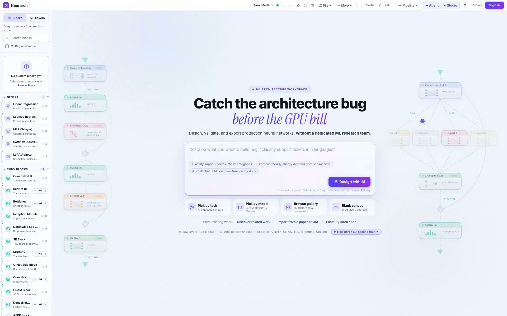
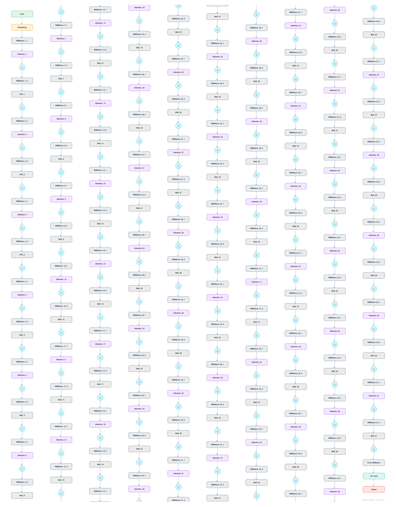
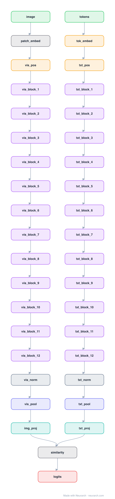
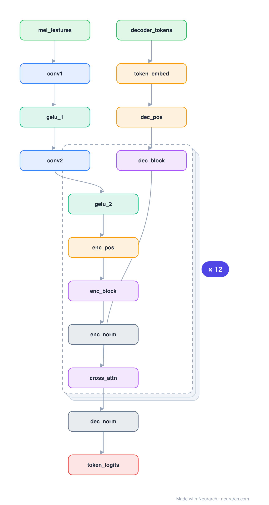
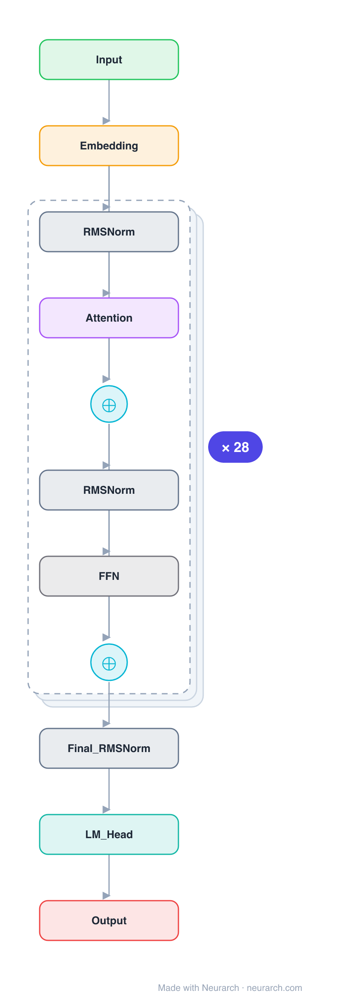

<div align="center">

# 🧠 Neurarch Model Zoo

### 78 reference architectures you can actually open, edit, validate, and train. From DeepSeek-V3's latent attention to ResNet's first skip connection. Not pictures. Graphs.

[](CATALOG.md)
[](https://github.com/neurarch-ai/awesome-llm-model-zoo/actions/workflows/validate.yml)
[](#catalog)
[](LICENSE)
[](CONTRIBUTING.md)

**[Full catalog](CATALOG.md)** · **[Browse by domain](#catalog)** · **[Open one in your browser](#open-any-architecture-in-one-click)** · **[Contribute](CONTRIBUTING.md)**

<br/>

<!-- Demo: this is the video poster frame, linked to the live app. To upgrade
     to an inline autoplaying GIF (GitHub strips <video> in READMEs), run:
       ffmpeg -i assets/demo.webm -vf "fps=12,scale=720:-1:flags=lanczos,split[s0][s1];[s0]palettegen[p];[s1][p]paletteuse" -loop 0 assets/demo.gif
     then replace the  below with assets/demo.gif. -->
<a href="https://www.neurarch.com/" title="Try Neurarch live"></a>

▶ **[Watch the 30-second demo](assets/demo.webm)** — import a checkpoint → fold the repeated blocks → export runnable training code. Or **[try it live](https://www.neurarch.com/)**.

</div>

---

Every diagram of Qwen or Mixtral you have ever seen is a dead image. The entries here are live, structurally validated model graphs:

- **Shape-checked end to end**: tensor shapes, attention head divisibility, GQA constraints. All 78 graphs pass with zero errors.
- **Verified numbers**: LLM hyperparameters are taken from each model's official `config.json`, not from blog posts.
- **One click to editable**: every entry opens straight onto the [Neurarch](https://www.neurarch.com/) canvas, where you can fork it, swap the attention, and re-validate before you ever launch a run.
- **Exportable to runnable training code**: TRL, torchtune, Unsloth, plain PyTorch.

## A few of the graphs

`model.json` always holds the **full** graph (every layer, real dimensions). The diagrams fold runs of identical blocks into one representative block with a `× N` badge, so even a 671B model fits on one screen, the way papers draw it.

<table>
<tr>
<td align="center" valign="top"><b><a href="architectures/deepseek-v3/">DeepSeek-V3</a></b><br/><sub>671B MoE · MLA · 3 dense + 58 MoE blocks</sub><br/></td>
<td align="center" valign="top"><b><a href="architectures/clip-vit-b32/">CLIP ViT-B/32</a></b><br/><sub>dual encoder · two towers into one space</sub><br/></td>
</tr>
<tr>
<td align="center" valign="top"><b><a href="architectures/whisper-small/">Whisper Small</a></b><br/><sub>conv stem · 12+12 enc-dec · cross-attention</sub><br/></td>
<td align="center" valign="top"><b><a href="architectures/qwen2.5-7b/">Qwen2.5-7B</a></b><br/><sub>GQA 28:4 · QKV bias · 28 blocks</sub><br/></td>
</tr>
</table>

The full expanded graph (every one of those 371 / 300 / … nodes) is one click away in Neurarch via the **Open in Neurarch** link on each entry. Parameter-faithful CNNs are here too: [ResNet-50](architectures/resnet-50/) (all 16 bottleneck blocks, 25.6M, exact) and [VGG-16](architectures/vgg-16/) (138M, exact).

## Open any architecture in one click

Every entry has an **Open in Neurarch** link that loads its graph straight onto the canvas, no download step:

```
https://www.neurarch.com/?import=https://raw.githubusercontent.com/neurarch-ai/awesome-llm-model-zoo/main/architectures/<id>/model.json
```

From there you have a live, validated graph you can fork, edit, re-validate, or export to training code.

Each folder under [`architectures/`](architectures/) contains:

| File | What it is |
|------|------------|
| `README.md` | What the model is, its **model URLs** (Neurarch, Hugging Face, GitHub, paper), verified hyperparameters, a parameter check, and design notes. |
| `model.json` | The full Neurarch graph: every layer at real dimensions, the same graph you get by importing the HF model in the app. |
| `assets/diagram.svg` / `.png` | Architecture diagram. Runs of identical blocks are folded into one representative block with a `× N` badge; `model.json` still holds them all. |

## Catalog

### 🔥 Frontier LLMs (2025-2026 wave)

The MoE generation. Every hyperparameter below is read from the model's official `config.json` (including the June 2026 releases), not from launch blog posts.

| Architecture | Org | Params (total / active) | Attention | Notable |
|--------------|-----|------------------------|-----------|---------|
| [deepseek-v3](architectures/deepseek-v3/) | DeepSeek | 671B / 37B | MLA, 128 heads | 256 experts + shared, the R1 base |
| [kimi-k2.6](architectures/kimi-k2.6/) | Moonshot AI | ~1T / ~32B | MLA, 64 heads | 384 experts, 256K context, vision encoder |
| [glm-4.5-air](architectures/glm-4.5-air/) | Zhipu AI | 106B / 12B | GQA 96:8 | Wide attention (3x hidden), 128 slim experts |
| [llama-4-scout](architectures/llama-4-scout/) | Meta | 109B / 17B | GQA 40:8 | Top-1 routing over 16 fat experts, iRoPE, 10M context |
| [gpt-oss-20b](architectures/gpt-oss-20b/) | OpenAI | 21B / 3.6B | GQA 64:8 | Sliding(128)/full alternation, attention sinks |
| [qwen3-8b](architectures/qwen3-8b/) | Alibaba Cloud | 8.2B (dense) | GQA 32:8 + QK-Norm | The default open dense model of 2025 |
| [gemma-4-12b](architectures/gemma-4-12b/) | Google DeepMind | 12B (dense) | GQA 16:8, 256-dim heads | 5:1 local:global attention, 262K vocab |
| [gpt-oss-120b](architectures/gpt-oss-120b/) | OpenAI | 117B / 5.1B | GQA 64:8 | 128 experts top-4, the bigger gpt-oss |
| [deepseek-v2-lite](architectures/deepseek-v2-lite/) | DeepSeek | 15.7B / 2.4B | MLA, 16 heads | The runnable way to study MLA + MoE |
| [deepseek-v2](architectures/deepseek-v2/) | DeepSeek | 236B / 21B | MLA, 128 heads | Where MLA + fine-grained MoE debuted |

Side quest: open [deepseek-v3](architectures/deepseek-v3/) and [llama-4-scout](architectures/llama-4-scout/) side by side. Same problem, opposite expert-granularity bets.

### 🇨🇳 Chinese LLMs

Selection informed by [awesome-pretrained-chinese-nlp-models](https://github.com/lonePatient/awesome-pretrained-chinese-nlp-models). Hyperparameters verified against each official `config.json`.

| Architecture | Org | Params | Attention | Notable |
|--------------|-----|--------|-----------|---------|
| [qwen2.5-7b](architectures/qwen2.5-7b/) | Alibaba Cloud | 7.6B | GQA 28:4 | QKV bias, 128K context |
| [deepseek-llm-7b](architectures/deepseek-llm-7b/) | DeepSeek | 7B | MHA 32 | Dense ancestor of the DeepSeek line |
| [chatglm3-6b](architectures/chatglm3-6b/) | Zhipu AI / THUDM | 6.2B | GQA 32:2 | Near-multi-query attention, partial RoPE |
| [baichuan2-7b](architectures/baichuan2-7b/) | Baichuan Inc. | 7B | MHA 32 | NormHead, 125K Chinese vocab |
| [yi-6b](architectures/yi-6b/) | 01.AI | 6B | GQA 32:4 | Llama-compatible, 200K-context variant |
| [internlm2-7b](architectures/internlm2-7b/) | Shanghai AI Lab | 7.7B | GQA 32:8 | Native 32K context |
| [minicpm-2b](architectures/minicpm-2b/) | OpenBMB / ModelBest | 2.4B | MHA 36 | Deep-and-thin, muP-style scaling |
| [skywork-13b](architectures/skywork-13b/) | Kunlun Tech | 13B | MHA 36 | 52-layer deep-and-thin, ablated in tech report |

### 🌍 LLM classics and building blocks

| Architecture | Org | Params | Notable |
|--------------|-----|--------|---------|
| [llama3-8b](architectures/llama3-8b/) | Meta | 8B | The baseline everything else is a delta against |
| [mistral-7b](architectures/mistral-7b/) | Mistral AI | 7.2B | Sliding-window + GQA |
| [gpt2-small](architectures/gpt2-small/) | OpenAI | 124M | The reference decoder-only transformer |
| [llama3-block](architectures/llama3-block/) | Meta | block | One Llama-3 decoder block, every op expanded |
| [mixtral-block](architectures/mixtral-block/) | Mistral AI | block | Sparse MoE: 8 experts, top-2 routing |
| [mamba-block](architectures/mamba-block/) | Gu and Dao | block | Selective SSM, no attention, O(T) |
| [phi3-mini](architectures/phi3-mini/) | Microsoft | block | 3.8B-class compact decoder block |
| [transformer-block](architectures/transformer-block/) | Vaswani et al. | block | The original 2017 post-norm encoder block |

### 🔬 Open & research LLMs (distinct architectures)

| Architecture | Org | Params | Notable |
|--------------|-----|--------|---------|
| [phi-2](architectures/phi-2/) | Microsoft | 2.78B | Parallel residual + partial RoPE; data-over-scale |
| [pythia-1.4b](architectures/pythia-1.4b/) | EleutherAI | 1.4B | GPT-NeoX parallel attn; the controlled training-dynamics suite |
| [olmo-7b](architectures/olmo-7b/) | Ai2 | 6.9B | Fully open (Dolma data + code); non-parametric LayerNorm |

### 📝 NLP encoders and seq2seq

| Architecture | Org | Params | Notable |
|--------------|-----|--------|---------|
| [bert-base](architectures/bert-base/) | Google | 110M | The encoder that started transfer learning in NLP |
| [modernbert-base](architectures/modernbert-base/) | Answer.AI / LightOn | 149M | BERT rebuilt with 2024 lessons: RoPE, GeGLU, 8K context |
| [chinese-roberta-wwm-ext](architectures/chinese-roberta-wwm-ext/) | HFL | 102M | The standard Chinese encoder baseline |
| [ernie-3.0-base-zh](architectures/ernie-3.0-base-zh/) | Baidu | 118M | 40K vocab, 2048 positions, knowledge-enhanced |
| [t5-small](architectures/t5-small/) | Google | 60M | Text-to-text encoder-decoder, full two-stream graph |
| [simple-rnn](architectures/simple-rnn/) | Elman lineage | starter | The smallest sequential model in the zoo |

### 🔎 Embeddings and retrieval

| Architecture | Org | Params | Notable |
|--------------|-----|--------|---------|
| [all-minilm-l6](architectures/all-minilm-l6/) | Microsoft / SBERT | 22.7M | The default RAG/semantic-search encoder; mean-pooled 384-dim |
| [bge-base-en](architectures/bge-base-en/) | BAAI | 109M | Long-time MTEB retrieval leader; CLS-pooled |

### 👁️ Computer vision

| Architecture | Org | Params | Notable |
|--------------|-----|--------|---------|
| [resnet-50](architectures/resnet-50/) | Microsoft Research | 25.6M | Full 50-node graph, every bottleneck expanded |
| [vgg-16](architectures/vgg-16/) | Oxford VGG | 138M | Depth + uniform 3x3 convs |
| [vit-b16](architectures/vit-b16/) | Google | 86M | Patch embedding + Transformer encoder |
| [swin-tiny](architectures/swin-tiny/) | Microsoft | 28M | Hierarchical ViT, shifted-window attention |
| [convnext-tiny](architectures/convnext-tiny/) | Meta | 28M | A ConvNet modernized to match Swin |
| [efficientnet-b0](architectures/efficientnet-b0/) | Google | 5.3M | MBConv + squeeze-excite, found by NAS |
| [densenet-121](architectures/densenet-121/) | Cornell et al. | 8M | Dense connectivity (concat every layer) |
| [unet](architectures/unet/) | Ronneberger et al. | 31M | Encoder-decoder with skip connections |
| [mobilenet-v2](architectures/mobilenet-v2/) | Google | 3.5M | Inverted residual blocks; the on-device / CoreML staple |
| [resnet-block](architectures/resnet-block/) | He et al. | block | The residual unit itself |
| [simple-cnn](architectures/simple-cnn/) | LeNet lineage | starter | The hello-world of computer vision |

### 🖼️ Multimodal

| Architecture | Org | Params | Notable |
|--------------|-----|--------|---------|
| [clip-vit-b32](architectures/clip-vit-b32/) | OpenAI | 151M | The contrastive dual encoder behind modern multimodality |
| [siglip-base](architectures/siglip-base/) | Google | 203M | CLIP with a sigmoid loss; the vision encoder of 2024+ MLLMs |
| [llava-1.5-7b](architectures/llava-1.5-7b/) | Microsoft / UW | ~7B | The canonical MLLM: vision encoder → MLP projector → LLM |
| [blip2](architectures/blip2/) | Salesforce | Q-Former | Learned queries bridge a frozen ViT and a frozen LLM |
| [flamingo](architectures/flamingo/) | DeepMind | gated x-attn | Perceiver resampler + gated cross-attention into a frozen LLM |

### 🎨 Generative

| Architecture | Org | Params | Notable |
|--------------|-----|--------|---------|
| [dit-xl2](architectures/dit-xl2/) | Berkeley / Meta | 675M | Diffusion with a Transformer backbone (SD3 / Sora-class) |
| [diffusion-unet](architectures/diffusion-unet/) | CompVis / Stability | ~860M | Stable-Diffusion latent UNet with text cross-attention |

### 🎙️ Audio and speech

| Architecture | Org | Params | Notable |
|--------------|-----|--------|---------|
| [whisper-small](architectures/whisper-small/) | OpenAI | 244M | Mel spectrogram, conv stem, enc-dec with cross-attention |
| [wav2vec2-base](architectures/wav2vec2-base/) | Meta AI | 95M | Conv feature extractor + Transformer; self-supervised speech |
| [hubert-base](architectures/hubert-base/) | Meta AI | 95M | Wav2Vec2 backbone, masked-cluster-prediction pretraining |
| [encodec](architectures/encodec/) | Meta AI | codec | Neural audio codec (conv + RVQ); the audio-LLM tokenizer |

### 🛒 Recommendation and ranking

| Architecture | Org | Notable |
|--------------|-----|---------|
| [two-tower](architectures/two-tower/) | Google lineage | The retrieval architecture behind almost every recommender |
| [wide-and-deep](architectures/wide-and-deep/) | Google | Memorization + generalization, joint trained |
| [dlrm](architectures/dlrm/) | Meta | Dense MLP + embeddings + pairwise interactions |
| [ncf](architectures/ncf/) | He et al. | Concat-then-MLP collaborative filtering |
| [neumf](architectures/neumf/) | He et al. | GMF + MLP fused, the full NCF model |
| [lightgcn](architectures/lightgcn/) | He et al. | Graph convolution stripped to pure propagation |
| [graph-sage-rec](architectures/graph-sage-rec/) | Stanford | Inductive sample-and-aggregate embeddings |
| [bst](architectures/bst/) | Alibaba | Transformer over user behavior sequences |
| [sli-rec](architectures/sli-rec/) | Microsoft Research | Time-aware LSTM + long-term attentive fusion |
| [deepfm](architectures/deepfm/) | Huawei | FM + deep MLP under one shared embedding (CTR) |
| [dcn](architectures/dcn/) | Google | Explicit feature crosses ∥ deep MLP |
| [din](architectures/din/) | Alibaba | Target-aware attention over behavior history (CTR) |
| [sasrec](architectures/sasrec/) | UCSD | Causal self-attention over item history (GPT-style) |
| [bert4rec](architectures/bert4rec/) | Alibaba | Bidirectional masked-item Transformer |
| [gru4rec](architectures/gru4rec/) | Gravity R&D | GRU over session clicks (the RNN baseline) |

### 📈 Time series and biosignals

| Architecture | Org | Notable |
|--------------|-----|---------|
| [patch-tst](architectures/patch-tst/) | Nie et al. | Patching + channel independence for forecasting |
| [cnn-lstm-1d](architectures/cnn-lstm-1d/) | standard baseline | Conv1D front-end + LSTM for ECG/PPG/IMU |
| [eegnet](architectures/eegnet/) | ARL | The universal EEG/BCI baseline, ~2.6K params |
| [eeg-conformer](architectures/eeg-conformer/) | Song et al. | Conv stem + Transformer for EEG decoding |

## Every entry is validated

This zoo has one bar, and it is not "looks right":

1. Every graph passes **structural validation with zero errors** — well-formed, fully connected, acyclic. A standalone, dependency-free checker ([`npm run validate`](scripts/validate.mjs)) re-runs this across all 78 entries and gates every push in [CI](https://github.com/neurarch-ai/awesome-llm-model-zoo/actions/workflows/validate.yml), so the badge above is a live check, not a claim. The generator additionally runs Neurarch's full shape propagation (tensor shapes, attention head divisibility, GQA constraints).
2. Every full-model `model.json` is the **complete layer stack**, built with the same import path the Neurarch app uses for "load from Hugging Face", and carries a **parameter check**: Neurarch's per-layer estimate vs. the real weight count (HF safetensors metadata or the official figure). **All 36 checked checkpoints land within 10%**, worst case 6.6%, most within a couple of percent. Tied weights (shared encoder/decoder embeddings, tied LM heads) and seq2seq cross-attention are modelled explicitly, so the per-layer sum matches the real count instead of over- or under-shooting. Every number is shown in the entry README and in [CATALOG.md](CATALOG.md), sorted worst-first. Nothing is rounded away.
3. Every full LLM entry's hyperparameters are pulled from the model's **official `config.json`**, with quirks (Qwen's QKV bias, Baichuan's NormHead, ChatGLM's 2 KV groups) called out in the entry README instead of papered over.
4. Every entry **exports to runnable training code** from the Neurarch canvas.

That bar caught real drift while building this repo: a widely copied Llama-3 block diagram carrying Llama-2's FFN size (11008 instead of 14336), and a "RoBERTa" checkpoint that is architecturally BERT. Validated graphs make those errors visible.

It also sets the inclusion rule for the frontier section: models whose configs are public (Kimi K2.6, Gemma 4) are in; models behind gated configs we could not verify (DeepSeek-V4.x, GLM-6) wait until we can read their `config.json`.

## Contributing

Designed an architecture in Neurarch you think others would find useful? See [CONTRIBUTING.md](CONTRIBUTING.md). The bar is the same as above: validate cleanly, export to runnable code, document the design choices.

## License

MIT. See [LICENSE](LICENSE). Use the architectures freely, attribution appreciated. Model weights referenced by entries remain under their upstream licenses (noted per entry).

---

<div align="center">

**If a graph here saved you a paper-reading session, [⭐ star the repo](https://github.com/neurarch-ai/awesome-llm-model-zoo) so the next person finds it.**

Built with [Neurarch](https://www.neurarch.com/), a graph-native design environment for ML model architectures.

</div>
