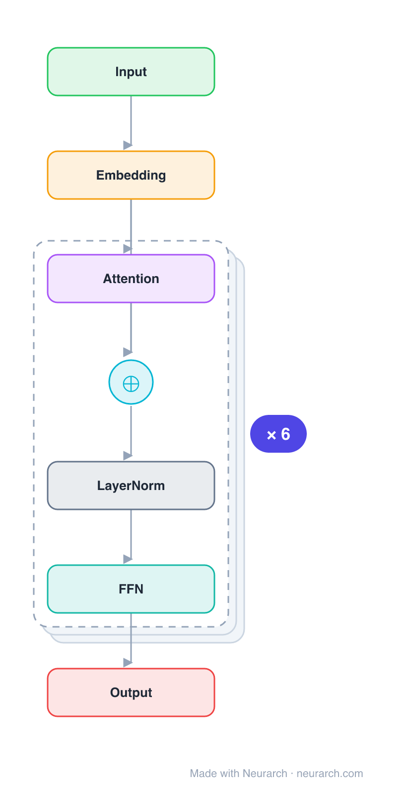

# all-MiniLM-L6-v2

The most-downloaded sentence-embedding model in the world: a 6-layer MiniLM distilled from BERT, mean-pooled into a 384-dim vector. The default workhorse for semantic search, RAG retrieval, and clustering when you want fast and small.

## Model URLs

| Where | URL |
|---|---|
| **Open in Neurarch** (live, editable graph) | https://www.neurarch.com/?import=https://raw.githubusercontent.com/neurarch-ai/awesome-llm-model-zoo/main/architectures/all-minilm-l6/model.json |
| Paper (MiniLM, Wang et al. 2020) | https://arxiv.org/abs/2002.10957 |
| Hugging Face | https://huggingface.co/sentence-transformers/all-MiniLM-L6-v2 |

## Architecture

*Identical repeated blocks are folded into one representative block with a `× N` badge, so the whole architecture fits on screen. `model.json` keeps all 27 nodes (open it in Neurarch to see and edit every layer). Vector: [diagram.svg](assets/diagram.svg).*

| Hyperparameter | Value |
|---|---|
| Type | Bidirectional encoder, sentence embedding |
| Parameters | 22.7M |
| Layers | 6 |
| Hidden size | 384 |
| Attention | Multi-head: 12 heads |
| FFN | Dense, 1536, GeLU |
| Normalization | LayerNorm, post-norm |
| Pooling | Mean over tokens → 384-dim sentence vector |
| Vocabulary | 30,522 |
| Max context | 256 (trained), 512 (max) |

`model.json` is the full graph, produced with the same import path the Neurarch app uses for "load from Hugging Face".

## Parameter check

Neurarch's per-layer parameter estimate over this graph: **22.4M**.
Hugging Face safetensors metadata reports **22.7M** for the real weights.
Deviation from the authoritative count (22.7M): **-1.5%**.

## Design notes

- Tiny BERT encoder (6 layers, 384 hidden) distilled via MiniLM's deep-self-attention distillation, then fine-tuned on 1B+ sentence pairs with a contrastive objective.
- The embedding is a mean pool over the token outputs (not the CLS token), then L2-normalized, so cosine similarity ranks relevance.
- At ~80MB and 384 dims it is the cheap retriever most RAG stacks start with.

## Files

| File | What it is |
|---|---|
| [`model.json`](model.json) | The full Neurarch graph (every layer, real dimensions). Open it at [neurarch.com](https://www.neurarch.com/) to edit or export training code. |
| [`assets/diagram.svg`](assets/diagram.svg) / [`.png`](assets/diagram.png) | Architecture diagram (repeated blocks folded with a `× N` badge). |

**License:** Apache 2.0. The graph and diagrams here describe the architecture; any referenced weights remain under the upstream license.
