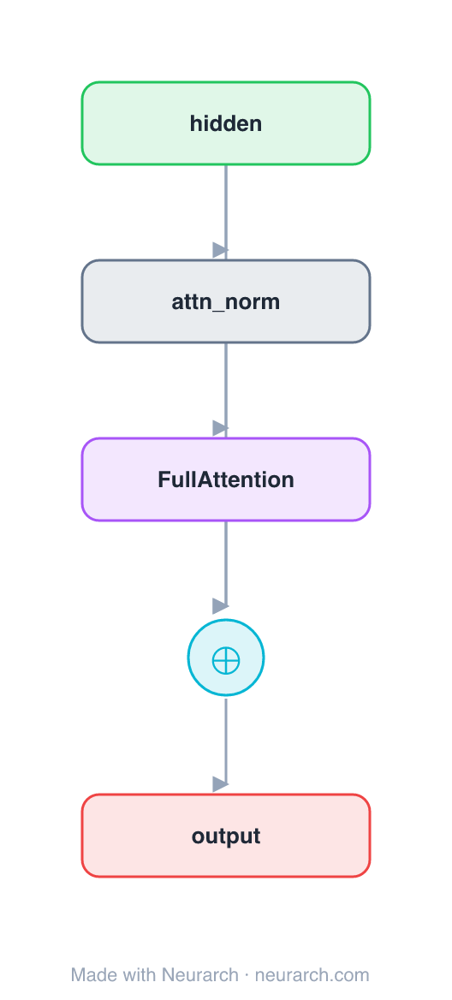

# Full Attention Block

A minimal pre-norm residual attention sub-block with **dense (full) self-attention**: every token attends to every other token. The O(n²) baseline that the sliding-window and sparse variants trade away for longer context.

This is the **first of three sibling blocks** that are identical except for the attention op, so the diff is exactly the attention mechanism. See [COMPARISONS.md → Attention sparsity](../../COMPARISONS.md#attention-sparsity-full--sliding-window--sparse).

## Model URLs

| Where | URL |
|---|---|
| **Open in Neurarch** (live, editable graph) | https://www.neurarch.com/?import=https://raw.githubusercontent.com/neurarch-ai/awesome-llm-model-zoo/main/architectures/attn-full/model.json |
| Paper (Vaswani et al. 2017) | https://arxiv.org/abs/1706.03762 |

## Architecture

<b>Layer-by-layer (5 nodes)</b>

| # | Layer | Type | Params |
|---|---|---|---|
| 1 | hidden | `input` | shape: [128, 512] |
| 2 | attn_norm | `layerNorm` | normalizedShape: 512 |
| 3 | FullAttention | `multiHeadAttention` | embedDim: 512, numHeads: 8 |
| 4 | residual | `add` |   |
| 5 | output | `output` |   |

Shape-validated end to end (passes Neurarch's shape propagation with zero errors).

## Design notes

- Dense attention: full n×n score matrix, quadratic in sequence length. Maximum expressivity, maximum cost.
- Pre-norm placement (norm before attention, residual around it), the modern default.
- Fork point: swap node 3 for `localAttention` or `nativeSparseAttention` to see the [sibling blocks](../../COMPARISONS.md#attention-sparsity-full--sliding-window--sparse), and re-validate instantly.

## Files

| File | What it is |
|---|---|
| [`model.json`](model.json) | The Neurarch graph. Shape-validated; open it at [neurarch.com](https://www.neurarch.com/) to edit or export training code. |
| [`assets/diagram.svg`](assets/diagram.svg) | Vector diagram (papers, slides). |
| [`assets/diagram.png`](assets/diagram.png) | Raster diagram (renders everywhere). |
