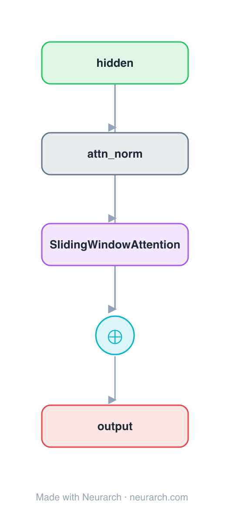

# Sliding-Window Attention Block

The same pre-norm residual attention sub-block as [attn-full](../attn-full/), with one node swapped: each token attends only to a fixed **window** of nearby tokens instead of the whole sequence. Cost drops from O(n²) to O(n·w), and stacking layers still grows the effective receptive field. The mechanism behind Longformer and Mistral.

**Second of three sibling blocks** (full → sliding-window → sparse), identical except the attention op. See [COMPARISONS.md → Attention sparsity](../../COMPARISONS.md#attention-sparsity-full--sliding-window--sparse).

## Model URLs

| Where | URL |
|---|---|
| **Open in Neurarch** (live, editable graph) | https://www.neurarch.com/?import=https://raw.githubusercontent.com/neurarch-ai/awesome-llm-model-zoo/main/architectures/attn-sliding-window/model.json |
| Paper (Longformer, Beltagy et al. 2020) | https://arxiv.org/abs/2004.05150 |

## Architecture

<b>Layer-by-layer (5 nodes)</b>

| # | Layer | Type | Params |
|---|---|---|---|
| 1 | hidden | `input` | shape: [128, 512] |
| 2 | attn_norm | `layerNorm` | normalizedShape: 512 |
| 3 | SlidingWindowAttention | `localAttention` | embedDim: 512, numHeads: 8, windowSize: 256 |
| 4 | residual | `add` |   |
| 5 | output | `output` |   |

Shape-validated end to end (passes Neurarch's shape propagation with zero errors).

## Design notes

- `windowSize` is the one knob: each query sees `windowSize` neighbours, so attention is linear in sequence length.
- Receptive field grows with depth: L stacked windows of size w reach ~L·w tokens, the trick that lets Mistral run a 4K window over much longer context.
- Same I/O shape as full attention, so it is a drop-in swap, exactly what the [comparison](../../COMPARISONS.md#attention-sparsity-full--sliding-window--sparse) shows.

## Files

| File | What it is |
|---|---|
| [`model.json`](model.json) | The Neurarch graph. Shape-validated; open it at [neurarch.com](https://www.neurarch.com/) to edit or export training code. |
| [`assets/diagram.svg`](assets/diagram.svg) | Vector diagram (papers, slides). |
| [`assets/diagram.png`](assets/diagram.png) | Raster diagram (renders everywhere). |
