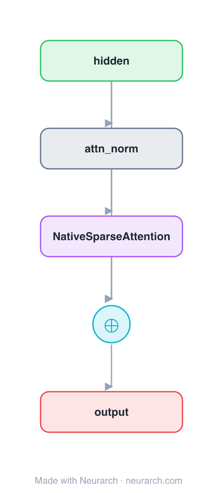

# Native Sparse Attention Block

The same pre-norm residual attention sub-block as [attn-full](../attn-full/), with one node swapped for **block-sparse attention**: the sequence is chunked into blocks and each query attends only to a selected top-k of them. Long-range reach without the full n×n cost, and hardware-aligned (block-granular) so it is fast in practice. The mechanism behind DeepSeek's Native Sparse Attention.

**Third of three sibling blocks** (full → sliding-window → sparse), identical except the attention op. See [COMPARISONS.md → Attention sparsity](../../COMPARISONS.md#attention-sparsity-full--sliding-window--sparse).

## Model URLs

| Where | URL |
|---|---|
| **Open in Neurarch** (live, editable graph) | https://www.neurarch.com/?import=https://raw.githubusercontent.com/neurarch-ai/awesome-llm-model-zoo/main/architectures/attn-sparse/model.json |
| Paper (Native Sparse Attention, DeepSeek 2025) | https://arxiv.org/abs/2502.11089 |

## Architecture

<b>Layer-by-layer (5 nodes)</b>

| # | Layer | Type | Params |
|---|---|---|---|
| 1 | hidden | `input` | shape: [128, 512] |
| 2 | attn_norm | `layerNorm` | normalizedShape: 512 |
| 3 | NativeSparseAttention | `nativeSparseAttention` | embedDim: 512, numHeads: 8, blockSize: 64, topBlocks: 16 |
| 4 | residual | `add` |   |
| 5 | output | `output` |   |

Shape-validated end to end (passes Neurarch's shape propagation with zero errors).

## Design notes

- Two knobs: `blockSize` (granularity of a chunk) and `topBlocks` (how many chunks each query keeps). Unlike a fixed window, the selected blocks can be anywhere in the sequence, so it keeps genuine long-range links.
- Block granularity is the point: selection and compute align to hardware tiles, which is why it stays fast where token-level sparsity does not.
- Drop-in with full / sliding-window attention (same I/O shape), the contrast the [comparison](../../COMPARISONS.md#attention-sparsity-full--sliding-window--sparse) draws.

## Files

| File | What it is |
|---|---|
| [`model.json`](model.json) | The Neurarch graph. Shape-validated; open it at [neurarch.com](https://www.neurarch.com/) to edit or export training code. |
| [`assets/diagram.svg`](assets/diagram.svg) | Vector diagram (papers, slides). |
| [`assets/diagram.png`](assets/diagram.png) | Raster diagram (renders everywhere). |
