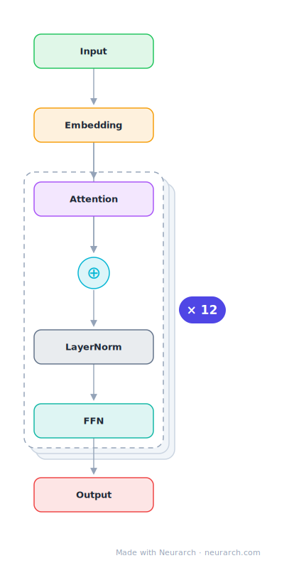

# BERT-Base

The bidirectional encoder that started the transfer-learning era in NLP. Twelve post-norm encoder blocks, 768 hidden, 12 heads: the shape every "base-size" encoder since has copied.

## Model URLs

| Where | URL |
|---|---|
| **Open in Neurarch** (live, editable graph) | https://www.neurarch.com/?import=https://raw.githubusercontent.com/neurarch-ai/neurarch-model-zoo/main/architectures/bert-base/model.json |
| Hugging Face | https://huggingface.co/google-bert/bert-base-uncased |
| GitHub | https://github.com/google-research/bert |

## Architecture

*Compact view: one block expanded. The full graph below is what `model.json` holds.*

<b>Full graph: 51 nodes (click to expand)</b>

| Hyperparameter | Value |
|---|---|
| Type | Bidirectional encoder (BERT family) |
| Parameters | 110M |
| Layers | 12 |
| Hidden size | 768 |
| Attention | Multi-head: 12 heads |
| FFN | Dense, 3,072, GeLU |
| Normalization | LayerNorm, post-norm |
| Positions | Absolute learned, max 512 |
| Vocabulary | 30,522 |

`model.json` is the full 12-layer graph, produced with the same import path the Neurarch app uses for "load from Hugging Face", with all hyperparameters from the official `config.json`.

## Parameter check

Neurarch's per-layer parameter estimate over this graph: **108.5M**.
Hugging Face safetensors metadata reports **110.1M** for the real weights.
Deviation from the authoritative count (110.1M): **-1.5%**.

## Design notes

- The model that made pretrain-then-finetune the default workflow in NLP (Devlin et al. 2018, arXiv 1810.04805).
- Post-norm placement: LayerNorm comes after each residual add, the original Transformer ordering that pre-norm models later abandoned for training stability.
- Learned absolute position embeddings hard-cap the context at 512 tokens.
- 30522-token WordPiece vocabulary; masked-language-modeling plus next-sentence-prediction pretraining.

## Files

| File | What it is |
|---|---|
| [`model.json`](model.json) | The full Neurarch graph (every layer, real dimensions). Open it at [neurarch.com](https://www.neurarch.com/) to edit or export training code. |
| [`assets/diagram.svg`](assets/diagram.svg) / [`.png`](assets/diagram.png) | Diagram of the full graph. |
| [`assets/block.svg`](assets/block.svg) / [`.png`](assets/block.png) | Compact one-block explainer view. |

**License:** Apache 2.0. The graph and diagrams here describe the architecture; the model weights remain under the upstream license.
