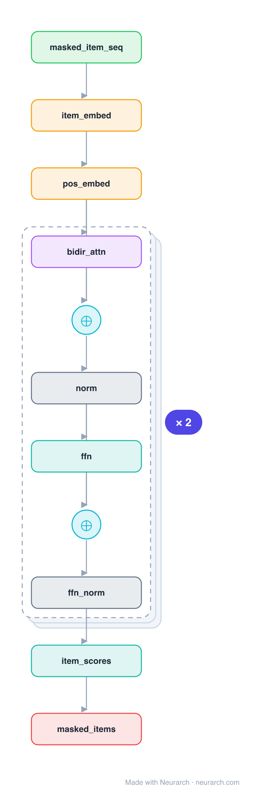

# BERT4Rec

The recsys answer to BERT: a bidirectional Transformer over the item sequence trained with masked-item (Cloze) prediction. Each item sees both its past and future neighbours, unlike causal SASRec.

## Model URLs

| Where | URL |
|---|---|
| **Open in Neurarch** (live, editable graph) | https://www.neurarch.com/?import=https://raw.githubusercontent.com/neurarch-ai/awesome-llm-model-zoo/main/architectures/bert4rec/model.json |
| Paper (Sun et al. 2019) | https://arxiv.org/abs/1904.06690 |

## Architecture

*Identical repeated blocks are folded into one representative block with a `× N` badge, so the whole architecture fits on screen. `model.json` keeps all 17 nodes (open it in Neurarch to see and edit every layer). Vector: [diagram.svg](assets/diagram.svg).*

| Hyperparameter | Value |
|---|---|
| Type | Sequential recommendation |
| Embedding | Item + learned positional |
| Backbone | Bidirectional Transformer encoder |
| Objective | Masked-item (Cloze) prediction |
| Key idea | Both-directions context, BERT-style |

`model.json` is the full graph, hand-built against the official config.json.

## Parameter check

Neurarch's per-layer parameter estimate over this graph: **27.2M**.

## Design notes

- Bidirectional self-attention plus a masked-item training objective (randomly mask items, predict them from both sides).
- The both-directions context can capture patterns a left-to-right model misses, at the cost of the Cloze-style training/serving mismatch.
- Directly comparable to [sasrec](../sasrec/): same inputs, bidirectional-masked vs causal.

## Files

| File | What it is |
|---|---|
| [`model.json`](model.json) | The full Neurarch graph (every layer, real dimensions). Open it at [neurarch.com](https://www.neurarch.com/) to edit or export training code. |
| [`assets/diagram.svg`](assets/diagram.svg) / [`.png`](assets/diagram.png) | Architecture diagram (repeated blocks folded with a `× N` badge). |
