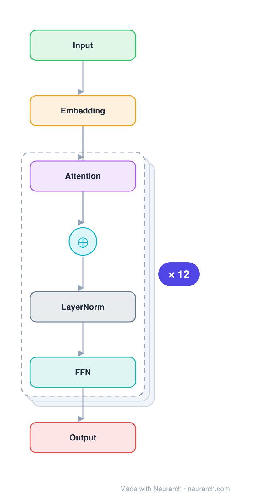

# BGE-base-en-v1.5

BAAI's BGE retriever, for a long stretch the top open English embedding model on the MTEB leaderboard. A BERT-base encoder fine-tuned with large-scale contrastive pretraining + instruction tuning; the CLS token is the embedding.

## Model URLs

| Where | URL |
|---|---|
| **Open in Neurarch** (live, editable graph) | https://www.neurarch.com/?import=https://raw.githubusercontent.com/neurarch-ai/awesome-llm-model-zoo/main/architectures/bge-base-en/model.json |
| Paper (C-Pack, Xiao et al. 2023) | https://arxiv.org/abs/2309.07597 |
| Hugging Face | https://huggingface.co/BAAI/bge-base-en-v1.5 |
| GitHub (FlagEmbedding) | https://github.com/FlagOpen/FlagEmbedding |

## Architecture

*Identical repeated blocks are folded into one representative block with a `× N` badge, so the whole architecture fits on screen. `model.json` keeps all 51 nodes (open it in Neurarch to see and edit every layer). Vector: [diagram.svg](assets/diagram.svg).*

| Hyperparameter | Value |
|---|---|
| Type | Bidirectional encoder, retrieval embedding |
| Parameters | 109M |
| Layers | 12 |
| Hidden size | 768 |
| Attention | Multi-head: 12 heads |
| FFN | Dense, 3072, GeLU |
| Normalization | LayerNorm, post-norm |
| Pooling | CLS token → 768-dim embedding |
| Vocabulary | 30,522 |
| Max context | 512 |

`model.json` is the full graph, produced with the same import path the Neurarch app uses for "load from Hugging Face".

## Parameter check

Neurarch's per-layer parameter estimate over this graph: **108.5M**.
Hugging Face safetensors metadata reports **109.5M** for the real weights.
Deviation from the authoritative count (109.5M): **-0.9%**.

## Design notes

- Architecturally plain BERT-base; all the lift is the C-Pack training recipe (contrastive pretraining on curated pairs, then task fine-tuning).
- Uses the CLS token as the sentence embedding (unlike all-MiniLM's mean pool), and recommends an instruction prefix for queries.
- The "base" tier balances quality and cost; -small and -large siblings trade the two.

## Files

| File | What it is |
|---|---|
| [`model.json`](model.json) | The full Neurarch graph (every layer, real dimensions). Open it at [neurarch.com](https://www.neurarch.com/) to edit or export training code. |
| [`assets/diagram.svg`](assets/diagram.svg) / [`.png`](assets/diagram.png) | Architecture diagram (repeated blocks folded with a `× N` badge). |

**License:** MIT. The graph and diagrams here describe the architecture; any referenced weights remain under the upstream license.
