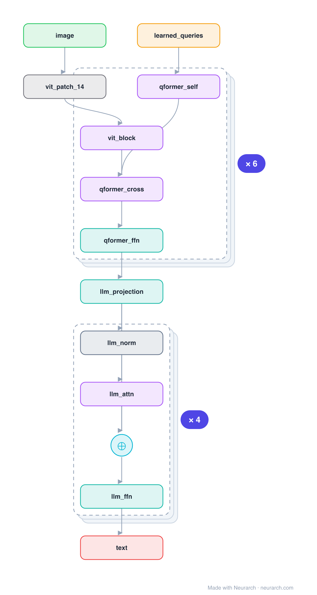

# BLIP-2

Bridges a frozen image encoder and a frozen LLM with a lightweight Querying Transformer. A fixed set of 32 learned query tokens cross-attend the image features, distilling them into something the language model can read, so almost no parameters are trained.

## Model URLs

| Where | URL |
|---|---|
| **Open in Neurarch** (live, editable graph) | https://www.neurarch.com/?import=https://raw.githubusercontent.com/neurarch-ai/awesome-llm-model-zoo/main/architectures/blip2/model.json |
| Paper (Li et al. 2023) | https://arxiv.org/abs/2301.12597 |
| Hugging Face | https://huggingface.co/Salesforce/blip2-opt-2.7b |

## Architecture

*Identical repeated blocks are folded into one representative block with a `× N` badge, so the whole architecture fits on screen. `model.json` keeps all 51 nodes (open it in Neurarch to see and edit every layer). Vector: [diagram.svg](assets/diagram.svg).*

| Hyperparameter | Value |
|---|---|
| Type | Multimodal (image-to-text) |
| Vision encoder | Frozen ViT |
| Bridge | Q-Former: 32 learned queries, self + cross-attention to image |
| LLM | Frozen (OPT / Flan-T5), fed the projected queries |
| Trained | Only the Q-Former (everything else frozen) |

`model.json` is the full graph, hand-built against the official config.json.

## Parameter check

Neurarch's per-layer parameter estimate over this graph: **1.15B**.

## Design notes

- The Q-Former is the whole idea: learned queries that self-attend each other and cross-attend the frozen image features, outputting a fixed 32-token visual summary.
- Both the vision encoder and the LLM stay frozen; only the small Q-Former (and a linear projection) are trained, which is why BLIP-2 is so cheap to build.
- A different bridge from [llava-1.5-7b](../llava-1.5-7b/)'s simple MLP projector, a learned cross-attention compressor vs a direct projection.

## Files

| File | What it is |
|---|---|
| [`model.json`](model.json) | The full Neurarch graph (every layer, real dimensions). Open it at [neurarch.com](https://www.neurarch.com/) to edit or export training code. |
| [`assets/diagram.svg`](assets/diagram.svg) / [`.png`](assets/diagram.png) | Architecture diagram (repeated blocks folded with a `× N` badge). |

**License:** MIT. The graph and diagrams here describe the architecture; any referenced weights remain under the upstream license.
