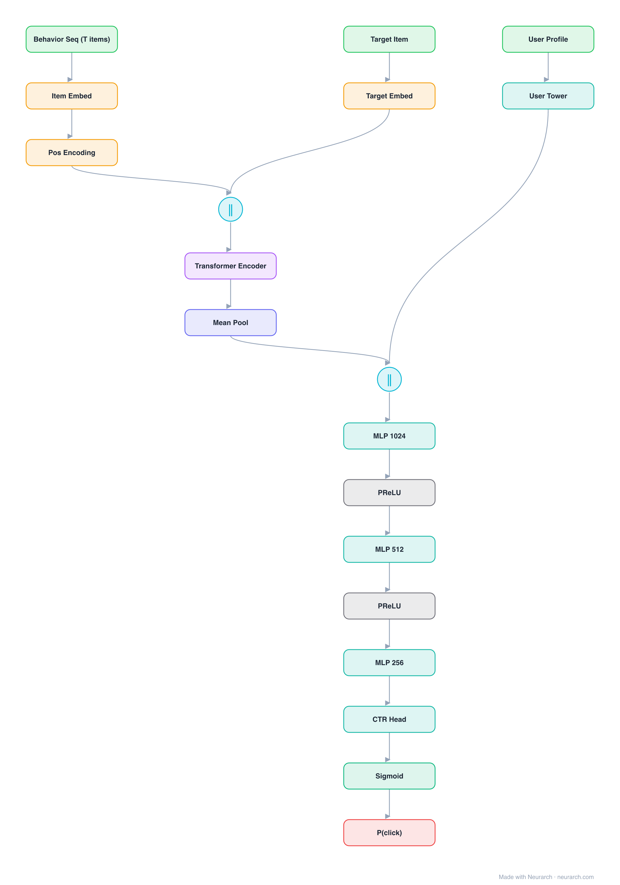

# Behavior Sequence Transformer

Alibaba's CTR model that replaced sum-pooled user history with a Transformer encoder over the click sequence, with the candidate item appended as the final sequence element.

## Model URLs

| Where | URL |
|---|---|
| **Open in Neurarch** (live, editable graph) | https://www.neurarch.com/?import=https://raw.githubusercontent.com/neurarch-ai/awesome-llm-model-zoo/main/architectures/bst/model.json |
| Paper (Chen et al. 2019) | https://arxiv.org/abs/1905.06874 |

## Architecture

<b>Layer-by-layer (19 nodes)</b>

| # | Layer | Type | Params |
|---|---|---|---|
| 1 | Behavior Seq (T items) | `input` | shape: [50] |
| 2 | Item Embed | `embedding` | vocabSize: 1000000, embeddingDim: 64 |
| 3 | Pos Encoding | `positionalEncoding` | dModel: 64, maxLen: 50 |
| 4 | Target Item | `input` | shape: [1] |
| 5 | Target Embed | `embedding` | vocabSize: 1000000, embeddingDim: 64 |
| 6 | [seq; tgt] | `concatenate` | dim: 1, numInputs: 2 |
| 7 | Transformer Encoder | `transformerBlock` | dModel: 64, numHeads: 8, dFf: 256, numLayers: 1, causal: false |
| 8 | Mean Pool | `globalAvgPool1d` |   |
| 9 | User Profile | `input` | shape: [16] |
| 10 | User Tower | `linear` | inFeatures: 16, outFeatures: 32 |
| 11 | Concat all | `concatenate` | dim: -1, numInputs: 2 |
| 12 | MLP 1024 | `linear` | inFeatures: 96, outFeatures: 1024 |
| 13 | PReLU | `prelu` |   |
| 14 | MLP 512 | `linear` | inFeatures: 1024, outFeatures: 512 |
| 15 | PReLU | `prelu` |   |
| 16 | MLP 256 | `linear` | inFeatures: 512, outFeatures: 256 |
| 17 | CTR Head | `linear` | inFeatures: 256, outFeatures: 1 |
| 18 | Sigmoid | `sigmoid` |   |
| 19 | P(click) | `output` |   |

This graph ships in Neurarch's in-app template library; the copy here passes shape propagation with zero errors.

## Design notes

- The candidate-in-sequence trick lets self-attention compute target-aware interest weights directly.
- Deployed in Taobao ranking; one of the first production proofs that Transformers transfer to recsys sequences.

## Files

| File | What it is |
|---|---|
| [`model.json`](model.json) | The Neurarch graph. Shape-validated; open it at [neurarch.com](https://www.neurarch.com/) to edit or export training code. |
| [`assets/diagram.svg`](assets/diagram.svg) | Vector diagram (papers, slides). |
| [`assets/diagram.png`](assets/diagram.png) | Raster diagram (renders everywhere). |
