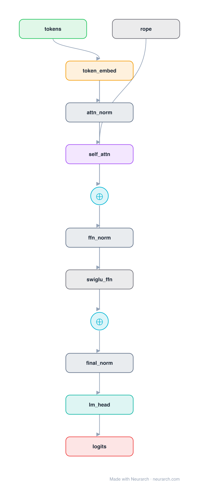

# ChatGLM3-6B

The third generation of the ChatGLM series from Zhipu AI and Tsinghua, historically the most-starred Chinese open LLM. A pre-norm decoder with extreme grouped (near-multi-query) attention and GLM-style partial rotary embeddings.

## Model URLs

| Where | URL |
|---|---|
| **Open in Neurarch** (live, editable graph) | https://www.neurarch.com/?import=https://raw.githubusercontent.com/neurarch-ai/neurarch-model-zoo/main/architectures/chatglm3-6b/model.json |
| Hugging Face | https://huggingface.co/THUDM/chatglm3-6b |
| GitHub | https://github.com/THUDM/ChatGLM3 |

## Architecture

*The full graph, all 173 nodes, tiled into columns for readability (read each column top-to-bottom, then left-to-right). Exactly what `model.json` holds. Vector: [diagram.svg](assets/diagram.svg).*

<b>One block, expanded (explainer view)</b>

| Hyperparameter | Value |
|---|---|
| Type | Decoder-only transformer (causal LM) |
| Parameters | 6.2B |
| Layers | 28 |
| Hidden size | 4096 |
| Attention | Grouped-query: 32 query heads, 2 KV heads |
| Head dim | 128 |
| FFN | SwiGLU, intermediate size 13,696 |
| Normalization | RMSNorm, pre-norm |
| Positions | RoPE (rotary dim 64) |
| Vocabulary | 65,024 |
| Max context | 8,192 |

`model.json` is the full 28-layer graph, produced with the same import path the Neurarch app uses for "load from Hugging Face" (with importer fixes noted in the generator script), with all hyperparameters from the official `config.json`.

## Parameter check

Neurarch's per-layer parameter estimate over this graph: **6.24B**.
Hugging Face safetensors metadata reports **6.24B** for the real weights.
Deviation from the authoritative count (6.24B): **-0.0%**.

## Design notes

- Aggressive multi-query-style attention: 32 query heads share only 2 KV groups (multi_query_group_num = 2), a 16:1 ratio that shrinks the KV cache far more than typical GQA.
- GLM-style partial RoPE: rotary embedding is applied to half of each 128-dim head (rotary dim 64); the other half stays position-free.
- The FFN intermediate size (13696) follows the GLM recipe rather than the Llama 8/3 ratio.
- 8192-token base context; -32k and -128k long-context variants exist. Input and output embeddings are untied (two 65024 x 4096 matrices).

## Files

| File | What it is |
|---|---|
| [`model.json`](model.json) | The full Neurarch graph (every layer, real dimensions). Open it at [neurarch.com](https://www.neurarch.com/) to edit or export training code. |
| [`assets/diagram.svg`](assets/diagram.svg) / [`.png`](assets/diagram.png) | Diagram of the full graph. |
| [`assets/block.svg`](assets/block.svg) / [`.png`](assets/block.png) | Compact one-block explainer view. |

**License:** Code Apache 2.0; weights under the ChatGLM3-6B license (free commercial use after registration). The graph and diagrams here describe the architecture; the model weights remain under the upstream license.
