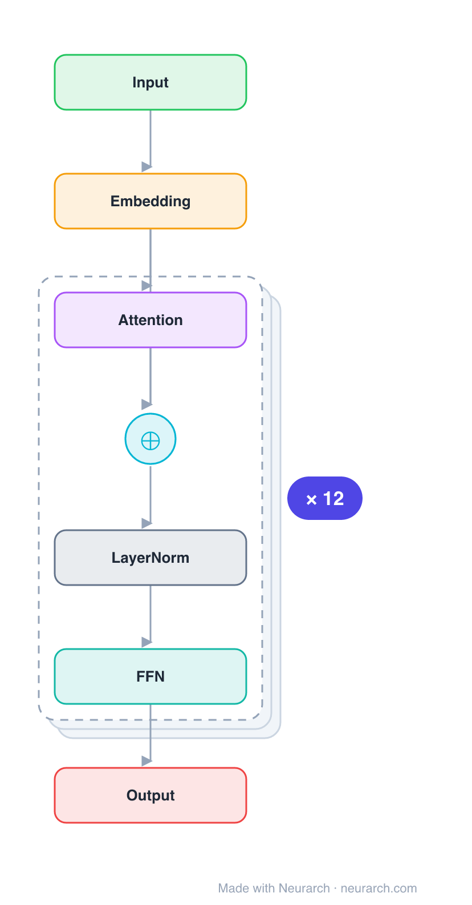

# Chinese-RoBERTa-wwm-ext

The standard Chinese encoder from HFL: BERT-base architecture trained RoBERTa-style with whole-word masking on extended data. Still the default starting point for Chinese classification, NER, and retrieval fine-tuning.

## Model URLs

| Where | URL |
|---|---|
| **Open in Neurarch** (live, editable graph) | https://www.neurarch.com/?import=https://raw.githubusercontent.com/neurarch-ai/neurarch-model-zoo/main/architectures/chinese-roberta-wwm-ext/model.json |
| Hugging Face | https://huggingface.co/hfl/chinese-roberta-wwm-ext |
| GitHub | https://github.com/ymcui/Chinese-BERT-wwm |

## Architecture

*Identical repeated blocks are folded into one representative block with a `× N` badge, so the whole architecture fits on screen. `model.json` keeps all 51 nodes (open it in Neurarch to see and edit every layer). Vector: [diagram.svg](assets/diagram.svg).*

| Hyperparameter | Value |
|---|---|
| Type | Bidirectional encoder (BERT family) |
| Parameters | 102M |
| Layers | 12 |
| Hidden size | 768 |
| Attention | Multi-head: 12 heads |
| FFN | Dense, 3,072, GeLU |
| Normalization | LayerNorm, post-norm |
| Positions | Absolute learned, max 512 |
| Vocabulary | 21,128 |

`model.json` is the full 12-layer graph, produced with the same import path the Neurarch app uses for "load from Hugging Face", with all hyperparameters from the official `config.json`.

## Parameter check

Neurarch's per-layer parameter estimate over this graph: **101.3M**.
Deviation from the authoritative count (102.0M): **-0.7%**.

## Design notes

- Despite the RoBERTa name, this is architecturally BERT-base: it loads as BertModel with absolute learned positions and post-layer-norm. "RoBERTa" refers to the training recipe (no NSP, dynamic masking), not the architecture.
- Whole-word masking (wwm) masks all WordPiece pieces of a Chinese word together, which matters because Chinese has no whitespace word boundaries.
- 21128-token Chinese WordPiece vocabulary, the de facto standard for Chinese BERT-family checkpoints.
- For a decade of Chinese NLU benchmarks (CLUE, etc.), this checkpoint was the baseline everyone compared against.

## Files

| File | What it is |
|---|---|
| [`model.json`](model.json) | The full Neurarch graph (every layer, real dimensions). Open it at [neurarch.com](https://www.neurarch.com/) to edit or export training code. |
| [`assets/diagram.svg`](assets/diagram.svg) / [`.png`](assets/diagram.png) | Architecture diagram (repeated blocks folded with a `× N` badge). |

**License:** Apache 2.0. The graph and diagrams here describe the architecture; the model weights remain under the upstream license.
