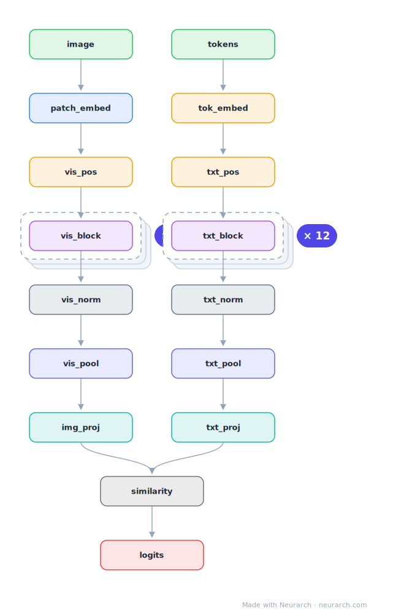

# CLIP ViT-B/32

The contrastive image-text model that underpins modern multimodality: a ViT image tower and a Transformer text tower projected into one 512-dim space, trained so matching pairs score high by dot product. Stable Diffusion's text encoder is the text half of this design.

## Model URLs

| Where | URL |
|---|---|
| **Open in Neurarch** (live, editable graph) | https://www.neurarch.com/?import=https://raw.githubusercontent.com/neurarch-ai/neurarch-model-zoo/main/architectures/clip-vit-b32/model.json |
| Paper (Radford et al. 2021) | https://arxiv.org/abs/2103.00020 |
| GitHub | https://github.com/openai/CLIP |
| Hugging Face | https://huggingface.co/openai/clip-vit-base-patch32 |

## Architecture

<b>Layer-by-layer (16 nodes)</b>

| # | Layer | Type | Params |
|---|---|---|---|
| 1 | image | `input` | shape: [3, 224, 224] |
| 2 | patch_embed | `patchEmbed` | imgSize: 224, patchSize: 32, embedDim: 768 |
| 3 | vis_pos | `positionalEncoding` | maxLen: 50, embedDim: 768 |
| 4 | vis_encoder | `transformerBlock` | embedDim: 768, numHeads: 12, ffDim: 3072 |
| 5 | vis_norm | `layerNorm` | normalizedShape: 768 |
| 6 | vis_pool | `globalAvgPool1d` |   |
| 7 | img_proj | `linear` | inFeatures: 768, outFeatures: 512 |
| 8 | tokens | `input` | shape: [1, 77] |
| 9 | tok_embed | `embedding` | numEmbeddings: 49408, embeddingDim: 512 |
| 10 | txt_pos | `positionalEncoding` | maxLen: 77, embedDim: 512 |
| 11 | txt_encoder | `transformerBlock` | embedDim: 512, numHeads: 8, ffDim: 2048 |
| 12 | txt_norm | `layerNorm` | normalizedShape: 512 |
| 13 | txt_pool | `globalAvgPool1d` |   |
| 14 | txt_proj | `linear` | inFeatures: 512, outFeatures: 512 |
| 15 | similarity | `matmul` |   |
| 16 | logits | `output` |   |

This graph is hand-built for the zoo, passes shape propagation with zero errors, and has its key dimensions verified against the official config.json.

## Design notes

- Two towers, one space: image (12-layer ViT, 768 hidden, patch 32) and text (12-layer Transformer, 512 hidden, 77-token context) each end in a linear projection to 512 dims.
- The similarity logit is just a scaled dot product between the two embeddings; in training, a batch of N pairs gives an NxN contrastive matrix.
- The graph pools each tower with an average-pool node as a stand-in for CLIP's token selection (class token for the image tower, EOT token for text).
- Tower dims verified from the official config.json; the text tower is causal, a quirk inherited from GPT-style pretraining.

## Files

| File | What it is |
|---|---|
| [`model.json`](model.json) | The Neurarch graph. Shape-validated; open it at [neurarch.com](https://www.neurarch.com/) to edit or export training code. |
| [`assets/diagram.svg`](assets/diagram.svg) | Vector diagram (papers, slides). |
| [`assets/diagram.png`](assets/diagram.png) | Raster diagram (renders everywhere). |

**License:** MIT. The graph and diagrams here describe the architecture; any referenced weights remain under the upstream license.
