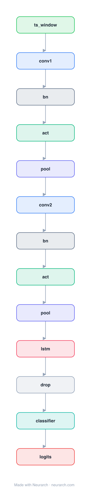

# 1D CNN + LSTM

The standard hybrid for long 1D physiological signals (ECG, PPG, IMU): a Conv1D front-end extracts local morphology, an LSTM models long-range temporal context, a dense head classifies.

## Model URLs

| Where | URL |
|---|---|
| **Open in Neurarch** (live, editable graph) | https://www.neurarch.com/?import=https://raw.githubusercontent.com/neurarch-ai/awesome-llm-model-zoo/main/architectures/cnn-lstm-1d/model.json |
| Survey (deep learning for ECG, Hong et al. 2020) | https://arxiv.org/abs/2001.00254 |

## Architecture

<b>Layer-by-layer (13 nodes)</b>

| # | Layer | Type | Params |
|---|---|---|---|
| 1 | ts_window | `input` | shape: [1, 12, 5000] |
| 2 | conv1 | `conv1d` | outChannels: 64, kernelSize: 7, stride: 1, padding: 3, inChannels: 1 |
| 3 | bn | `batchNorm` | normalizedShape: 64 |
| 4 | act | `relu` |   |
| 5 | pool | `maxpool1d` | kernelSize: 2, stride: 2 |
| 6 | conv2 | `conv1d` | outChannels: 128, kernelSize: 5, stride: 1, padding: 2, inChannels: 64 |
| 7 | bn | `batchNorm` | normalizedShape: 128 |
| 8 | act | `relu` |   |
| 9 | pool | `maxpool1d` | kernelSize: 2, stride: 2 |
| 10 | lstm | `lstm` | inFeatures: 128, hiddenSize: 128, numLayers: 2, returnSequences: false |
| 11 | drop | `dropout` | p: 0.3 |
| 12 | classifier | `linear` | outFeatures: 5, inFeatures: 128 |
| 13 | logits | `output` |   |

This graph ships in Neurarch's in-app template library; the copy here passes shape propagation with zero errors.

## Design notes

- No single canonical paper: this is the pattern that appears in hundreds of biosignal papers, included as the reference baseline.
- The conv stem downsamples aggressively so the LSTM sees a short, feature-rich sequence instead of raw samples.

## Files

| File | What it is |
|---|---|
| [`model.json`](model.json) | The Neurarch graph. Shape-validated; open it at [neurarch.com](https://www.neurarch.com/) to edit or export training code. |
| [`assets/diagram.svg`](assets/diagram.svg) | Vector diagram (papers, slides). |
| [`assets/diagram.png`](assets/diagram.png) | Raster diagram (renders everywhere). |
