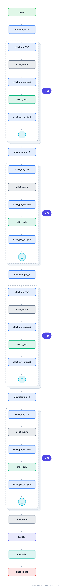

# ConvNeXt-Tiny

A pure ConvNet rebuilt with every Transformer-era trick (large 7x7 depthwise kernels, LayerNorm not BatchNorm, GeLU, inverted bottleneck, fewer activations) until it matched Swin on ImageNet. The "ConvNets strike back" architecture.

## Model URLs

| Where | URL |
|---|---|
| **Open in Neurarch** (live, editable graph) | https://www.neurarch.com/?import=https://raw.githubusercontent.com/neurarch-ai/awesome-llm-model-zoo/main/architectures/convnext-tiny/model.json |
| Paper (Liu et al. 2022) | https://arxiv.org/abs/2201.03545 |
| Hugging Face | https://huggingface.co/facebook/convnext-tiny-224 |

## Architecture

*Identical repeated blocks are folded into one representative block with a `× N` badge, so the whole architecture fits on screen. `model.json` keeps all 117 nodes (open it in Neurarch to see and edit every layer). Vector: [diagram.svg](assets/diagram.svg).*

| Hyperparameter | Value |
|---|---|
| Type | Modernized convolutional network |
| Parameters | 28M |
| Stem | 4x4/4 patchify conv (96) |
| Stages | 4 stages, depths 3/3/9/3 |
| ConvNeXt block | depthwise 7x7 → LayerNorm → 1x1 expand → GeLU → 1x1 project + residual |
| Downsampling | 2x2/2 conv between stages |

`model.json` is the full graph, hand-built against the official config.json.

## Parameter check

Neurarch's per-layer parameter estimate over this graph: **28.6M**.

## Design notes

- The block is essentially a Transformer block with the attention replaced by a large-kernel depthwise conv: depthwise mixes space, the 1x1s mix channels (an inverted bottleneck), with one LayerNorm and one GeLU.
- No attention anywhere, yet it tracks [swin-tiny](../swin-tiny/) closely, the paper's point about how much of ViT's win was design vs attention.

## Files

| File | What it is |
|---|---|
| [`model.json`](model.json) | The full Neurarch graph (every layer, real dimensions). Open it at [neurarch.com](https://www.neurarch.com/) to edit or export training code. |
| [`assets/diagram.svg`](assets/diagram.svg) / [`.png`](assets/diagram.png) | Architecture diagram (repeated blocks folded with a `× N` badge). |

**License:** Apache 2.0. The graph and diagrams here describe the architecture; any referenced weights remain under the upstream license.
