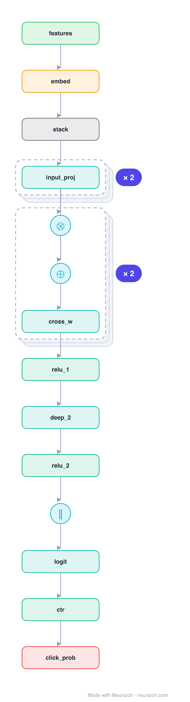

# DCN-v2

The production successor to DCN. Each cross layer applies a full weight matrix to the feature vector before the element-wise cross with the input (x0 . (W x_l) + x_l), so the crosses are far more expressive than DCN's rank-1 version, while a low-rank factorization keeps the cost down. Deployed across Google ad and feed ranking.

## Model URLs

| Where | URL |
|---|---|
| **Open in Neurarch** (live, editable graph) | https://www.neurarch.com/?import=https://raw.githubusercontent.com/neurarch-ai/awesome-llm-model-zoo/main/architectures/dcn-v2/model.json |
| Paper (Wang et al. 2021) | https://arxiv.org/abs/2008.13535 |

## Architecture

*Identical repeated blocks are folded into one representative block with a `× N` badge, so the whole architecture fits on screen. `model.json` keeps all 18 nodes (open it in Neurarch to see and edit every layer). Vector: [diagram.svg](assets/diagram.svg).*

| Hyperparameter | Value |
|---|---|
| Type | CTR / click prediction |
| Cross network | Matrix-weighted cross per layer, plus residual |
| Deep network | Parallel MLP |
| Fusion | Concatenate cross + deep then logit |
| Key idea | Full (low-rank) cross matrix replaces DCN's rank-1 cross |

`model.json` is the full graph, hand-built against the official config.json.

## Parameter check

This entry is a **structural reference**: its parameter mix is not recomputed by the per-layer estimator, so it carries no deviation gate. See the hyperparameter table above for the authoritative total / active parameter counts.

## Design notes

- The defining change from [dcn](../dcn/): the cross uses a learned matrix W (here a full linear), where the original used a rank-1 weight vector.
- Reference topology: features projected to a base vector x0, two matrix-cross layers, a parallel deep MLP, then concatenation.
- In practice the cross matrix is low-rank (a bottleneck) to control parameters at production feature counts.

## Files

| File | What it is |
|---|---|
| [`model.json`](model.json) | The full Neurarch graph (every layer, real dimensions). Open it at [neurarch.com](https://www.neurarch.com/) to edit or export training code. |
| [`assets/diagram.svg`](assets/diagram.svg) / [`.png`](assets/diagram.png) | Architecture diagram (repeated blocks folded with a `× N` badge). |
