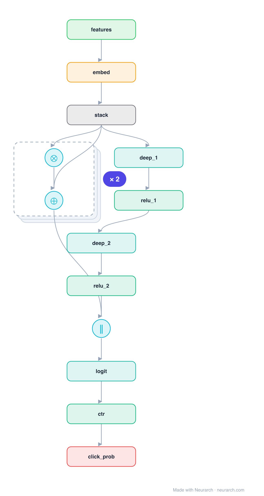

# DCN (Deep & Cross)

Google's Deep & Cross Network: a cross network that applies an explicit feature-crossing formula at every layer (so L layers give degree-L crosses), run alongside a deep MLP and concatenated. Generalizes DeepFM's fixed second-order FM to arbitrary order.

## Model URLs

| Where | URL |
|---|---|
| **Open in Neurarch** (live, editable graph) | https://www.neurarch.com/?import=https://raw.githubusercontent.com/neurarch-ai/awesome-llm-model-zoo/main/architectures/dcn/model.json |
| Paper (Wang et al. 2017) | https://arxiv.org/abs/1708.05123 |

## Architecture

*Identical repeated blocks are folded into one representative block with a `× N` badge, so the whole architecture fits on screen. `model.json` keeps all 15 nodes (open it in Neurarch to see and edit every layer). Vector: [diagram.svg](assets/diagram.svg).*

| Hyperparameter | Value |
|---|---|
| Type | CTR / click prediction |
| Cross network | Stacked layers, each an explicit feature cross + residual |
| Deep network | Parallel MLP |
| Fusion | Concatenate cross + deep → logit → sigmoid |
| Key idea | Bounded-degree feature crosses learned explicitly |

`model.json` is the full graph, hand-built against the official config.json.

## Parameter check

Neurarch's per-layer parameter estimate over this graph: **10.1M**.

## Design notes

- Each cross layer computes x0 · xl^T · w + xl (a residual feature cross), so stacking k layers yields explicit crosses up to degree k+1 with very few parameters.
- The cross and deep networks run in parallel and are concatenated before the final logit.
- DCN-v2 later swapped the rank-1 cross for a low-rank matrix; this is the original formulation.

## Files

| File | What it is |
|---|---|
| [`model.json`](model.json) | The full Neurarch graph (every layer, real dimensions). Open it at [neurarch.com](https://www.neurarch.com/) to edit or export training code. |
| [`assets/diagram.svg`](assets/diagram.svg) / [`.png`](assets/diagram.png) | Architecture diagram (repeated blocks folded with a `× N` badge). |
