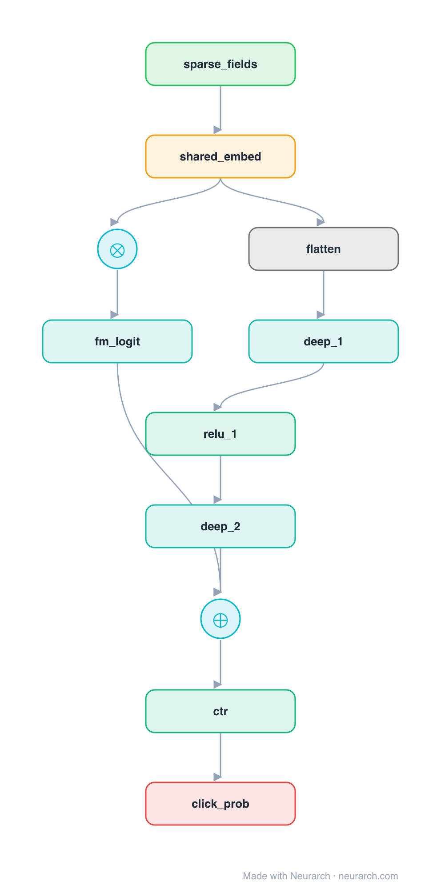

# DeepFM

The CTR model that fused a factorization machine with a deep network under one shared embedding table. FM captures low-order feature interactions, the MLP captures high-order, and unlike Wide & Deep neither path needs hand-engineered crosses.

## Model URLs

| Where | URL |
|---|---|
| **Open in Neurarch** (live, editable graph) | https://www.neurarch.com/?import=https://raw.githubusercontent.com/neurarch-ai/awesome-llm-model-zoo/main/architectures/deepfm/model.json |
| Paper (Guo et al. 2017) | https://arxiv.org/abs/1703.04247 |

## Architecture

*The full graph, all 11 nodes. Vector: [diagram.svg](assets/diagram.svg).*

| Hyperparameter | Value |
|---|---|
| Type | CTR / click prediction |
| FM branch | Shared embeddings → pairwise (2nd-order) interactions |
| Deep branch | Same embeddings flattened → MLP (high-order) |
| Fusion | Sum of the two logits → sigmoid |
| Key idea | No manual feature crosses (vs Wide & Deep) |

`model.json` is the full graph, hand-built against the official config.json.

## Parameter check

Neurarch's per-layer parameter estimate over this graph: **10.0M**.

## Design notes

- Both branches read the SAME embedding table, so the FM and deep components are trained jointly without separate feature engineering.
- The FM branch models explicit second-order (pairwise) interactions; the deep MLP models higher-order ones implicitly.
- The ancestor of a whole family (xDeepFM, AutoInt, DCN); pairs with [wide-and-deep](../wide-and-deep/) as the "learned vs hand-crafted crosses" comparison.

## Files

| File | What it is |
|---|---|
| [`model.json`](model.json) | The full Neurarch graph (every layer, real dimensions). Open it at [neurarch.com](https://www.neurarch.com/) to edit or export training code. |
| [`assets/diagram.svg`](assets/diagram.svg) / [`.png`](assets/diagram.png) | Architecture diagram (repeated blocks folded with a `× N` badge). |
