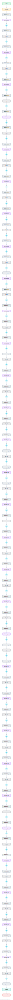

# DeepSeek-LLM-7B

The original dense 7B model from DeepSeek, trained on 2T bilingual tokens. A clean Llama-style decoder (RoPE, RMSNorm, SwiGLU) with a large bilingual vocabulary, and the architectural starting point of the DeepSeek lineage.

## Model URLs

| Where | URL |
|---|---|
| **Open in Neurarch** (live, editable graph) | https://www.neurarch.com/?import=https://raw.githubusercontent.com/neurarch-ai/neurarch-model-zoo/main/architectures/deepseek-llm-7b/model.json |
| Hugging Face | https://huggingface.co/deepseek-ai/deepseek-llm-7b-base |
| GitHub | https://github.com/deepseek-ai/DeepSeek-LLM |

## Architecture

| Hyperparameter | Value |
|---|---|
| Type | Decoder-only transformer (causal LM) |
| Parameters | 7B |
| Layers | 30 |
| Hidden size | 4096 |
| Attention | Multi-head: 32 heads |
| Head dim | 128 |
| FFN | SwiGLU, intermediate size 11,008 |
| Normalization | RMSNorm, pre-norm |
| Positions | RoPE (rotary dim 128) |
| Vocabulary | 102,400 |
| Max context | 4,096 |

The diagram and `model.json` show the full forward path with one of the 30 identical decoder blocks expanded (the stack repeats x30). All hyperparameters are taken from the official `config.json` on Hugging Face.

## Design notes

- The dense ancestor of the DeepSeek series, before the MoE turn (V2/V3). Architecture is deliberately Llama-compatible: model_type in config.json is literally "llama".
- Plain multi-head attention at 7B (32 Q = 32 KV heads); only the 67B sibling adopted grouped-query attention.
- 30 layers instead of the usual 32, slightly shallower and wider than Llama-2-7B.
- Large 102400-token byte-level BPE vocabulary tuned for bilingual Chinese and English text.

## Files

| File | What it is |
|---|---|
| [`model.json`](model.json) | The Neurarch graph. Shape-validated; open it at [neurarch.com](https://www.neurarch.com/) to edit or export training code. |
| [`assets/diagram.svg`](assets/diagram.svg) | Vector diagram (papers, slides). |
| [`assets/diagram.png`](assets/diagram.png) | Raster diagram (renders everywhere). |

**License:** Code MIT; weights under the DeepSeek Model License (commercial use permitted). The graph and diagrams here describe the architecture; the model weights remain under the upstream license.
