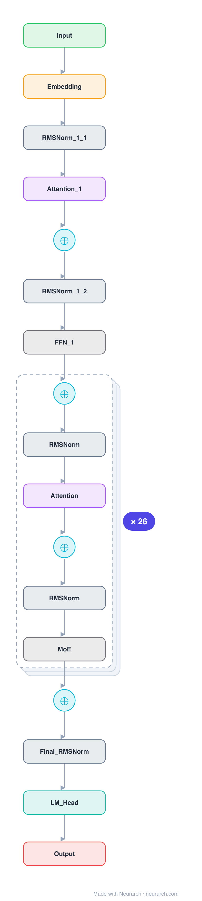

# DeepSeek-V2-Lite

The small, runnable member of the DeepSeek-V2 family and the most accessible way to study multi-head latent attention. Same MLA + fine-grained-MoE recipe as DeepSeek-V3, shrunk to 16B total / 2.4B active so it fits on one GPU.

## Model URLs

| Where | URL |
|---|---|
| **Open in Neurarch** (live, editable graph) | https://www.neurarch.com/?import=https://raw.githubusercontent.com/neurarch-ai/awesome-llm-model-zoo/main/architectures/deepseek-v2-lite/model.json |
| Paper (DeepSeek-V2, Liu et al. 2024) | https://arxiv.org/abs/2405.04434 |
| Hugging Face | https://huggingface.co/deepseek-ai/DeepSeek-V2-Lite |

## Architecture

*Identical repeated blocks are folded into one representative block with a `× N` badge, so the whole architecture fits on screen. `model.json` keeps all 167 nodes (open it in Neurarch to see and edit every layer). Vector: [diagram.svg](assets/diagram.svg).*

| Hyperparameter | Value |
|---|---|
| Type | Decoder-only transformer, sparse MoE (causal LM) |
| Parameters | 15.7B total, 2.4B active |
| Layers | 27 |
| Hidden size | 2048 |
| Attention | Multi-head latent (MLA): 16 heads, KV latent 512 (no Q latent at this size) |
| FFN | MoE: 64 routed experts, top-6 + 2 shared, expert dim 1408; first layer dense |
| Normalization | RMSNorm, pre-norm |
| Positions | Decoupled RoPE |
| Vocabulary | 102,400 |
| Max context | 163,840 |

`model.json` is the full graph, produced with the same import path the Neurarch app uses for "load from Hugging Face".

## Parameter check

Neurarch's per-layer parameter estimate over this graph: **15.79B**.
Hugging Face safetensors metadata reports **15.71B** for the real weights.
Deviation from the authoritative count (15.71B): **+0.5%**.

## Design notes

- Multi-head latent attention (MLA): keys and values are compressed to a 512-dim latent per token; at this scale queries skip the extra Q-latent that the 236B V2 and 671B V3 use.
- Fine-grained MoE: 64 routed experts (top-6) plus 2 always-on shared experts, slim 1408-dim each; the first layer stays dense.
- The cheapest entry point to the architecture that defined the DeepSeek line, see [deepseek-v3](../deepseek-v3/) for the full-scale version.

## Files

| File | What it is |
|---|---|
| [`model.json`](model.json) | The full Neurarch graph (every layer, real dimensions). Open it at [neurarch.com](https://www.neurarch.com/) to edit or export training code. |
| [`assets/diagram.svg`](assets/diagram.svg) / [`.png`](assets/diagram.png) | Architecture diagram (repeated blocks folded with a `× N` badge). |

**License:** Code MIT; weights under the DeepSeek Model License. The graph and diagrams here describe the architecture; any referenced weights remain under the upstream license.
