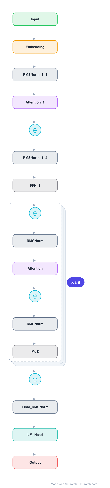

# DeepSeek-V2

The 236B MoE where multi-head latent attention and fine-grained mixture-of-experts debuted, the architecture the whole DeepSeek line is built on. Cheap KV cache from MLA, cheap compute from 160 slim experts.

## Model URLs

| Where | URL |
|---|---|
| **Open in Neurarch** (live, editable graph) | https://www.neurarch.com/?import=https://raw.githubusercontent.com/neurarch-ai/awesome-llm-model-zoo/main/architectures/deepseek-v2/model.json |
| Hugging Face | https://huggingface.co/deepseek-ai/DeepSeek-V2 |
| GitHub | https://github.com/deepseek-ai/DeepSeek-V2 |

## Architecture

*Identical repeated blocks are folded into one representative block with a `× N` badge, so the whole architecture fits on screen. `model.json` keeps all 365 nodes (open it in Neurarch to see and edit every layer). Vector: [diagram.svg](assets/diagram.svg).*

| Hyperparameter | Value |
|---|---|
| Type | Decoder-only transformer, sparse MoE (causal LM) |
| Parameters | 236B total, 21B active |
| Layers | 60 |
| Hidden size | 5120 |
| Attention | Multi-head latent: 128 heads; KV latent 512, Q latent 1536; per head 128 NoPE + 64 RoPE, V 128 |
| FFN | MoE: 160 routed experts, top-6 + 1 shared, expert dim 1,536; first 1 layer dense (12,288) |
| Normalization | RMSNorm, pre-norm |
| Positions | RoPE (rotary dim 64) |
| Vocabulary | 102,400 |
| Max context | 163,840 |

`model.json` is the full 60-layer graph, produced with the same import path the Neurarch app uses for "load from Hugging Face", with all hyperparameters from the official `config.json`.

## Parameter check

Neurarch's per-layer parameter estimate over this graph: **233.08B**.
Hugging Face safetensors metadata reports **235.74B** for the real weights.
Deviation from the authoritative count (235.74B): **-1.1%**.

## Design notes

- The model that introduced multi-head latent attention and fine-grained MoE, the recipe DeepSeek-V3 later scaled. 236B total, only 21B active per token.
- MLA: KV compressed to a 512-dim latent, Q to a 1536-dim latent; each of 128 heads splits into 128-dim NoPE content + 64-dim decoupled RoPE.
- 160 routed experts (top-6) + 2 shared, slim 1536-dim each; first layer dense.
- See [deepseek-v2-lite](../deepseek-v2-lite/) for the runnable 16B version and [deepseek-v3](../deepseek-v3/) for the scaled-up 671B.

## Files

| File | What it is |
|---|---|
| [`model.json`](model.json) | The full Neurarch graph (every layer, real dimensions). Open it at [neurarch.com](https://www.neurarch.com/) to edit or export training code. |
| [`assets/diagram.svg`](assets/diagram.svg) / [`.png`](assets/diagram.png) | Architecture diagram (repeated blocks folded with a `× N` badge). |

**License:** Code MIT; weights under the DeepSeek Model License. The graph and diagrams here describe the architecture; the model weights remain under the upstream license.
