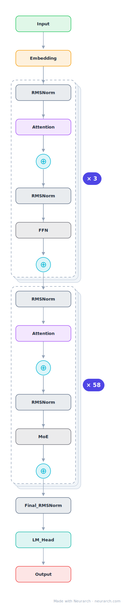

# DeepSeek-V3

The 671B-parameter MoE that made frontier-scale open weights real, and the architecture behind DeepSeek-R1. Two signature moves: multi-head latent attention for cheap KV cache, and 256 fine-grained experts with a shared expert.

## Model URLs

| Where | URL |
|---|---|
| **Open in Neurarch** (live, editable graph) | https://www.neurarch.com/?import=https://raw.githubusercontent.com/neurarch-ai/neurarch-model-zoo/main/architectures/deepseek-v3/model.json |
| Hugging Face | https://huggingface.co/deepseek-ai/DeepSeek-V3 |
| GitHub | https://github.com/deepseek-ai/DeepSeek-V3 |

## Architecture

| Hyperparameter | Value |
|---|---|
| Type | Decoder-only transformer, sparse MoE (causal LM) |
| Parameters | 671B total, 37B active |
| Layers | 61 |
| Hidden size | 7168 |
| Attention | Multi-head latent: 128 heads; KV latent 512, Q latent 1536; per head 128 NoPE + 64 RoPE, V 128 |
| FFN | MoE: 256 routed experts, top-8 + 1 shared, expert dim 2,048; first 3 layers dense (18,432) |
| Normalization | RMSNorm, pre-norm |
| Positions | RoPE (rotary dim 64) |
| Vocabulary | 129,280 |
| Max context | 163,840 |

The diagram and `model.json` show the full forward path with one of the 61 decoder blocks expanded (the stack repeats x61). All hyperparameters are taken from the official `config.json` on Hugging Face.

## Design notes

- Multi-head latent attention (MLA): K and V are compressed into a 512-dim latent per token (Q through a 1536-dim latent), cutting the KV cache by an order of magnitude versus GQA at this scale. Each of the 128 heads splits into a 128-dim content (NoPE) part and a shared 64-dim decoupled RoPE part.
- Fine-grained MoE: 256 routed experts (top-8) plus 1 always-on shared expert, each expert a slim 2048-dim SwiGLU; the first 3 layers stay dense (18432).
- Auxiliary-loss-free load balancing via per-expert bias terms, plus a multi-token-prediction head at training time (dropped at inference).
- The base of DeepSeek-R1: the reasoning model is this exact graph post-trained with RL.

## Files

| File | What it is |
|---|---|
| [`model.json`](model.json) | The Neurarch graph. Shape-validated; open it at [neurarch.com](https://www.neurarch.com/) to edit or export training code. |
| [`assets/diagram.svg`](assets/diagram.svg) | Vector diagram (papers, slides). |
| [`assets/diagram.png`](assets/diagram.png) | Raster diagram (renders everywhere). |

**License:** Code MIT; weights under the DeepSeek Model License (V3) and MIT from V3-0324 on. The graph and diagrams here describe the architecture; the model weights remain under the upstream license.
