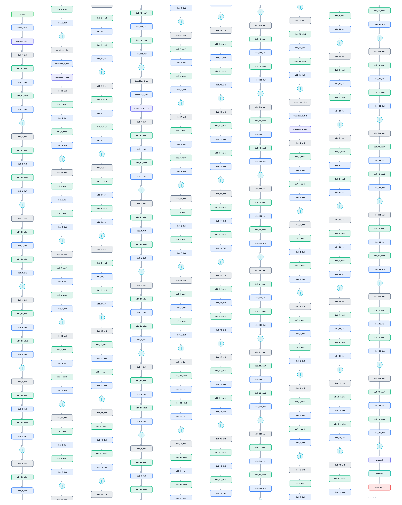

# DenseNet-121

The network where every layer is connected to every other layer in its block: each layer reads the concatenation of all preceding feature maps. Feature reuse instead of re-learning gives strong accuracy at very few parameters.

## Model URLs

| Where | URL |
|---|---|
| **Open in Neurarch** (live, editable graph) | https://www.neurarch.com/?import=https://raw.githubusercontent.com/neurarch-ai/awesome-llm-model-zoo/main/architectures/densenet-121/model.json |
| Paper (Huang et al. 2017) | https://arxiv.org/abs/1608.06993 |
| Hugging Face | https://huggingface.co/timm/densenet121.tv_in1k |

## Architecture

*The full graph, all 363 nodes. Vector: [diagram.svg](assets/diagram.svg).*

| Hyperparameter | Value |
|---|---|
| Type | Densely-connected convolutional network |
| Parameters | 8M |
| Stem | 7x7/2 conv + 3x3/2 max-pool |
| Dense blocks | 4 blocks, 6/12/24/16 layers |
| Dense layer | BN → ReLU → 1x1 → BN → ReLU → 3x3, output concatenated to input |
| Transitions | BN → 1x1 conv → avg-pool (halve channels) between blocks |

`model.json` is the full graph, hand-built against the official config.json.

## Parameter check

Neurarch's per-layer parameter estimate over this graph: **8.0M**.

## Design notes

- The defining op is the concatenate: a layer adds only a small "growth" (32 channels here) but sees everything before it, so gradients and features flow directly to every layer.
- Transition layers between blocks compress channels with a 1x1 conv + pooling so the concatenation does not explode.
- The opposite design philosophy from [resnet-50](../resnet-50/) (additive skips): DenseNet concatenates instead of adds.

## Files

| File | What it is |
|---|---|
| [`model.json`](model.json) | The full Neurarch graph (every layer, real dimensions). Open it at [neurarch.com](https://www.neurarch.com/) to edit or export training code. |
| [`assets/diagram.svg`](assets/diagram.svg) / [`.png`](assets/diagram.png) | Architecture diagram (repeated blocks folded with a `× N` badge). |

**License:** Apache 2.0 / BSD. The graph and diagrams here describe the architecture; any referenced weights remain under the upstream license.
