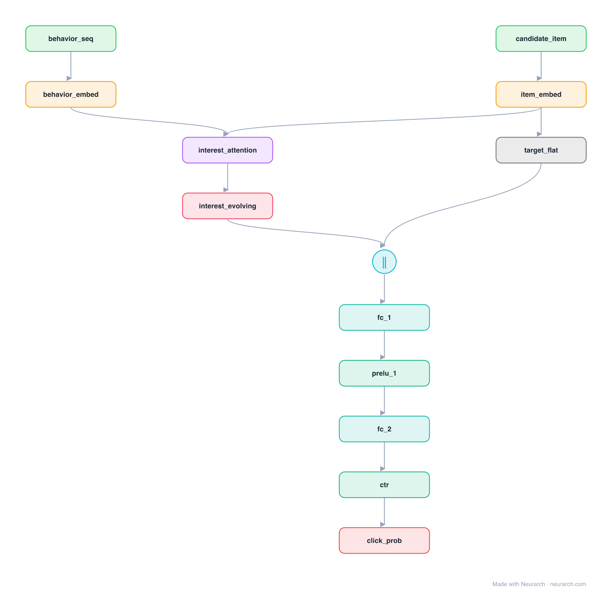

# DIEN

Deep Interest Evolution Network: the sequel to DIN. After a target-aware attention scores the behaviour history, a GRU-based interest-evolution layer models how the user's interest moves over time before the CTR head. Captures temporal drift that DIN's single attention pool cannot.

## Model URLs

| Where | URL |
|---|---|
| **Open in Neurarch** (live, editable graph) | https://www.neurarch.com/?import=https://raw.githubusercontent.com/neurarch-ai/awesome-llm-model-zoo/main/architectures/dien/model.json |
| Paper (Zhou et al. 2019) | https://arxiv.org/abs/1809.03672 |

## Architecture

*The full graph, all 13 nodes. Vector: [diagram.svg](assets/diagram.svg).*

| Hyperparameter | Value |
|---|---|
| Type | CTR with user-behavior sequence |
| Interest attention | Target-aware scoring of the behaviour sequence |
| Interest evolution | GRU over the attended interests |
| Head | Concat evolved interest + candidate then MLP |
| Key idea | Model how interest drifts, not just which items matter |

`model.json` is the full graph, hand-built against the official config.json.

## Parameter check

This entry is a **structural reference**: its parameter mix is not recomputed by the per-layer estimator, so it carries no deviation gate. See the hyperparameter table above for the authoritative total / active parameter counts.

## Design notes

- Builds directly on [din](../din/): same target-aware activation idea, with a recurrent interest-evolution layer added on top.
- Reference topology: behaviour attention into a GRU, concatenated with the candidate embedding before the MLP head.
- The full paper adds an auxiliary loss on the interest-extraction GRU and an attention-gated AUGRU; this graph shows the core evolution path.

## Files

| File | What it is |
|---|---|
| [`model.json`](model.json) | The full Neurarch graph (every layer, real dimensions). Open it at [neurarch.com](https://www.neurarch.com/) to edit or export training code. |
| [`assets/diagram.svg`](assets/diagram.svg) / [`.png`](assets/diagram.png) | Architecture diagram (repeated blocks folded with a `× N` badge). |
