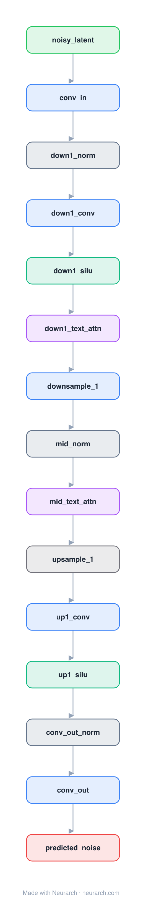

# Diffusion U-Net (Stable Diffusion)

The latent-diffusion noise predictor behind Stable Diffusion: a U-Net operating on 64x64 latents, conditioned on the timestep and on text embeddings via cross-attention at every resolution.

## Model URLs

| Where | URL |
|---|---|
| **Open in Neurarch** (live, editable graph) | https://www.neurarch.com/?import=https://raw.githubusercontent.com/neurarch-ai/awesome-llm-model-zoo/main/architectures/diffusion-unet/model.json |
| Paper (Rombach et al. 2022) | https://arxiv.org/abs/2112.10752 |
| GitHub | https://github.com/CompVis/stable-diffusion |
| Hugging Face | https://huggingface.co/CompVis/stable-diffusion-v1-4 |

## Architecture

<b>Layer-by-layer (15 nodes)</b>

| # | Layer | Type | Params |
|---|---|---|---|
| 1 | noisy_latent | `input` | shape: [4, 64, 64] |
| 2 | conv_in | `conv2d` | outChannels: 320, kernelSize: 3, stride: 1, padding: 1, inChannels: 4 |
| 3 | down1_norm | `groupNorm` | numGroups: 32, numChannels: 320 |
| 4 | down1_conv | `conv2d` | outChannels: 320, kernelSize: 3, stride: 1, padding: 1, inChannels: 320 |
| 5 | down1_silu | `swish` |   |
| 6 | down1_text_attn | `crossAttention` | embedDim: 320, numHeads: 8, kvDim: 768 |
| 7 | downsample_1 | `conv2d` | outChannels: 640, kernelSize: 3, stride: 2, padding: 1, inChannels: 320 |
| 8 | mid_norm | `groupNorm` | numGroups: 32, numChannels: 640 |
| 9 | mid_text_attn | `crossAttention` | embedDim: 640, numHeads: 8, kvDim: 768 |
| 10 | upsample_1 | `upsample` | scaleFactor: 2, mode: nearest |
| 11 | up1_conv | `conv2d` | outChannels: 320, kernelSize: 3, stride: 1, padding: 1, inChannels: 640 |
| 12 | up1_silu | `swish` |   |
| 13 | conv_out_norm | `groupNorm` | numGroups: 32, numChannels: 320 |
| 14 | conv_out | `conv2d` | outChannels: 4, kernelSize: 3, stride: 1, padding: 1, inChannels: 320 |
| 15 | predicted_noise | `output` |   |

This graph ships in Neurarch's in-app template library; the copy here passes shape propagation with zero errors.

## Design notes

- Cross-attention is the text-conditioning mechanism: image latents attend to CLIP text embeddings inside each block.
- Works in 4x64x64 VAE latent space rather than pixels, which is the "latent" in latent diffusion and why it fits on consumer GPUs.
- This is a compact reference graph of the conditioning topology, not a parameter-faithful replica of the ~860M UNet.

## Files

| File | What it is |
|---|---|
| [`model.json`](model.json) | The Neurarch graph. Shape-validated; open it at [neurarch.com](https://www.neurarch.com/) to edit or export training code. |
| [`assets/diagram.svg`](assets/diagram.svg) | Vector diagram (papers, slides). |
| [`assets/diagram.png`](assets/diagram.png) | Raster diagram (renders everywhere). |

**License:** CreativeML OpenRAIL-M (SD 1.x weights). The graph and diagrams here describe the architecture; any referenced weights remain under the upstream license.
