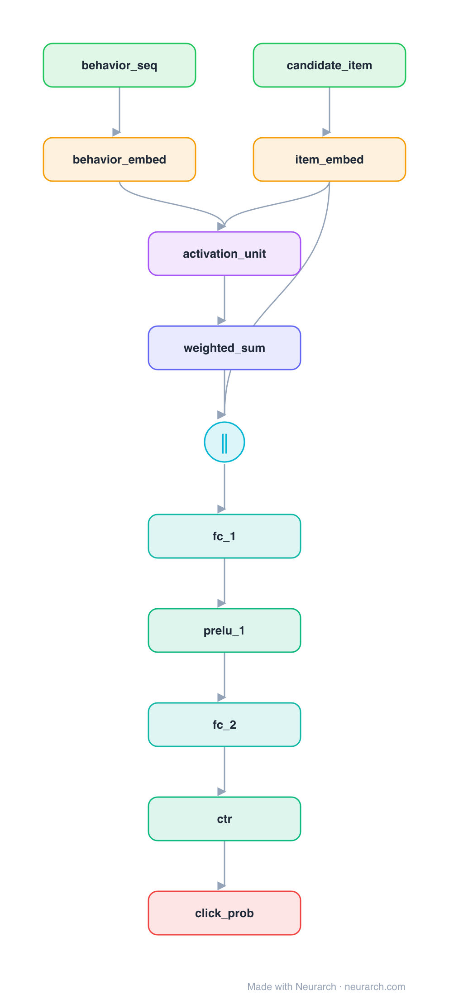

# DIN (Deep Interest Network)

Alibaba's production CTR model that replaced fixed sum-pooling of a user's behaviour history with an attention "activation unit": each past behaviour is weighted by how relevant it is to the candidate item, so the user's interest vector is target-aware.

## Model URLs

| Where | URL |
|---|---|
| **Open in Neurarch** (live, editable graph) | https://www.neurarch.com/?import=https://raw.githubusercontent.com/neurarch-ai/awesome-llm-model-zoo/main/architectures/din/model.json |
| Paper (Zhou et al. 2018) | https://arxiv.org/abs/1706.06978 |

## Architecture

*The full graph, all 12 nodes. Vector: [diagram.svg](assets/diagram.svg).*

| Hyperparameter | Value |
|---|---|
| Type | CTR with user-behavior sequence |
| Activation unit | Attention of behaviours w.r.t. the candidate item |
| Interest | Relevance-weighted sum of behaviours (not mean pool) |
| Head | Concat interest + candidate → MLP → sigmoid |
| Key idea | Target-aware interest representation |

`model.json` is the full graph, hand-built against the official config.json.

## Parameter check

Neurarch's per-layer parameter estimate over this graph: **128.0M**.

## Design notes

- The activation unit is a local attention between the candidate item and each historical behaviour; high-relevance behaviours dominate the pooled interest.
- This is the recsys insight that "a user's interest is multi-modal, attend to the part relevant to what you are scoring".
- Followed by DIEN (adds a GRU-based interest-evolution layer); compare with [bst](../bst/), which instead runs a full Transformer over the behaviour sequence.

## Files

| File | What it is |
|---|---|
| [`model.json`](model.json) | The full Neurarch graph (every layer, real dimensions). Open it at [neurarch.com](https://www.neurarch.com/) to edit or export training code. |
| [`assets/diagram.svg`](assets/diagram.svg) / [`.png`](assets/diagram.png) | Architecture diagram (repeated blocks folded with a `× N` badge). |
