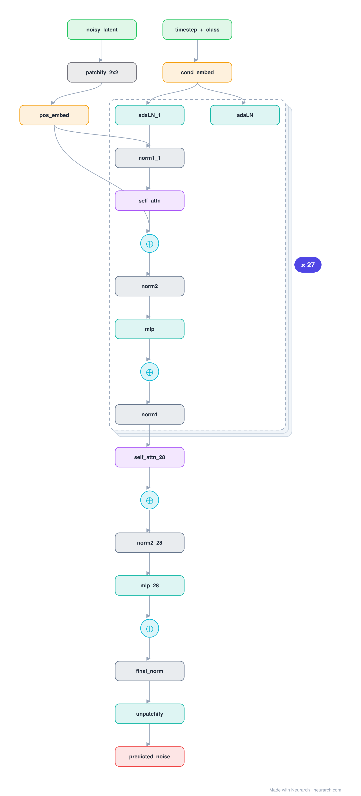

# DiT-XL/2

The model that replaced the diffusion U-Net with a plain Transformer over latent patches, conditioned by adaptive LayerNorm. DiT scaled cleanly and became the backbone of Stable Diffusion 3, PixArt, and Sora-class video models.

## Model URLs

| Where | URL |
|---|---|
| **Open in Neurarch** (live, editable graph) | https://www.neurarch.com/?import=https://raw.githubusercontent.com/neurarch-ai/awesome-llm-model-zoo/main/architectures/dit-xl2/model.json |
| Paper (Peebles and Xie 2023) | https://arxiv.org/abs/2212.09748 |
| GitHub | https://github.com/facebookresearch/DiT |

## Architecture

*Identical repeated blocks are folded into one representative block with a `× N` badge, so the whole architecture fits on screen. `model.json` keeps all 204 nodes (open it in Neurarch to see and edit every layer). Vector: [diagram.svg](assets/diagram.svg).*

| Hyperparameter | Value |
|---|---|
| Type | Diffusion model, Transformer backbone |
| Parameters | 675M (XL/2) |
| Layers | 28 DiT blocks |
| Hidden size | 1152 |
| Attention | Multi-head: 16 heads |
| Conditioning | adaLN-zero from timestep + class embedding |
| Patches | 2x2 over a 32x32x4 latent |
| FFN | Dense MLP, 4608, GeLU |

`model.json` is the full graph, hand-built against the official config.json.

## Parameter check

Neurarch's per-layer parameter estimate over this graph: **670.7M**.

## Design notes

- adaLN-zero: each block's LayerNorm scale/shift (and residual gates) are produced by a linear from the timestep + class embedding, so conditioning enters through normalization rather than cross-attention.
- Operates in VAE latent space (4x32x32) on 2x2 patches, exactly the ViT recipe applied to a denoiser.
- Replacing the U-Net (see [diffusion-unet](../diffusion-unet/)) with a Transformer is why diffusion now scales like LLMs do.

## Files

| File | What it is |
|---|---|
| [`model.json`](model.json) | The full Neurarch graph (every layer, real dimensions). Open it at [neurarch.com](https://www.neurarch.com/) to edit or export training code. |
| [`assets/diagram.svg`](assets/diagram.svg) / [`.png`](assets/diagram.png) | Architecture diagram (repeated blocks folded with a `× N` badge). |

**License:** CC-BY-NC (weights). The graph and diagrams here describe the architecture; any referenced weights remain under the upstream license.
