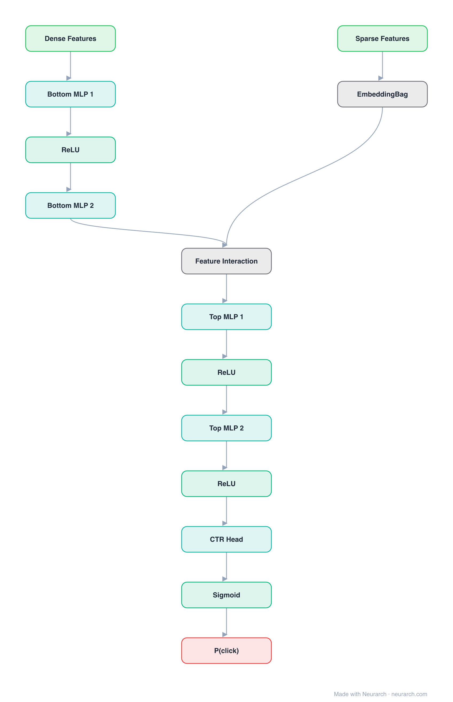

# DLRM

Meta's production recommendation architecture: a bottom MLP for dense features, embedding tables for sparse features, explicit pairwise dot-product interactions, and a top MLP over the result.

## Model URLs

| Where | URL |
|---|---|
| **Open in Neurarch** (live, editable graph) | https://www.neurarch.com/?import=https://raw.githubusercontent.com/neurarch-ai/neurarch-model-zoo/main/architectures/dlrm/model.json |
| Paper (Naumov et al. 2019) | https://arxiv.org/abs/1906.00091 |
| GitHub | https://github.com/facebookresearch/dlrm |

## Architecture

<b>Layer-by-layer (14 nodes)</b>

| # | Layer | Type | Params |
|---|---|---|---|
| 1 | Dense Features | `input` | shape: [13] |
| 2 | Bottom MLP 1 | `linear` | inFeatures: 13, outFeatures: 64 |
| 3 | ReLU | `relu` |   |
| 4 | Bottom MLP 2 | `linear` | inFeatures: 64, outFeatures: 32 |
| 5 | Sparse Features | `input` | shape: [26] |
| 6 | EmbeddingBag | `embeddingBag` | vocabSize: 1000000, embeddingDim: 32 |
| 7 | Feature Interaction | `featureInteraction` | method: dot |
| 8 | Top MLP 1 | `linear` | inFeatures: 415, outFeatures: 512 |
| 9 | ReLU | `relu` |   |
| 10 | Top MLP 2 | `linear` | inFeatures: 512, outFeatures: 256 |
| 11 | ReLU | `relu` |   |
| 12 | CTR Head | `linear` | inFeatures: 256, outFeatures: 1 |
| 13 | Sigmoid | `sigmoid` |   |
| 14 | P(click) | `output` |   |

This graph ships in Neurarch's in-app template library; the copy here passes shape propagation with zero errors.

## Design notes

- The explicit pairwise interaction layer (dot products between all embedding pairs) is the signature; it is factorization machines absorbed into a deep net.
- At production scale the embedding tables dominate parameters so heavily that DLRM training is a memory-bandwidth problem, which shaped a generation of recsys hardware.

## Files

| File | What it is |
|---|---|
| [`model.json`](model.json) | The Neurarch graph. Shape-validated; open it at [neurarch.com](https://www.neurarch.com/) to edit or export training code. |
| [`assets/diagram.svg`](assets/diagram.svg) | Vector diagram (papers, slides). |
| [`assets/diagram.png`](assets/diagram.png) | Raster diagram (renders everywhere). |
