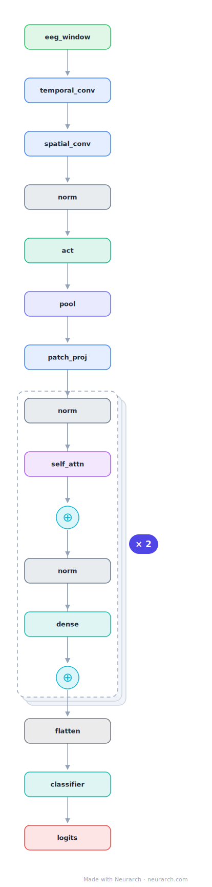

# EEG Conformer

Convolution meets attention for EEG decoding: an EEGNet-style conv stem tokenizes the signal, then a Transformer encoder models long-range temporal dependencies. State of the art on motor-imagery benchmarks.

## Model URLs

| Where | URL |
|---|---|
| **Open in Neurarch** (live, editable graph) | https://www.neurarch.com/?import=https://raw.githubusercontent.com/neurarch-ai/neurarch-model-zoo/main/architectures/eeg-conformer/model.json |
| Paper (Song et al. 2022, IEEE TNSRE) | https://ieeexplore.ieee.org/document/9991178 |
| GitHub | https://github.com/eeyhsong/EEG-Conformer |

## Architecture

<b>Layer-by-layer (22 nodes)</b>

| # | Layer | Type | Params |
|---|---|---|---|
| 1 | eeg_window | `input` | shape: [1, 22, 1000] |
| 2 | temporal_conv | `conv2d` | outChannels: 40, kernelSize: [1, 25], stride: 1, padding: 0 |
| 3 | spatial_conv | `conv2d` | outChannels: 40, kernelSize: [22, 1], stride: 1, padding: 0 |
| 4 | norm | `batchNorm` | normalizedShape: 40 |
| 5 | act | `elu` |   |
| 6 | pool | `avgpool2d` | kernelSize: [1, 75], stride: [1, 15] |
| 7 | patch_proj | `conv2d` | outChannels: 40, kernelSize: [1, 1], stride: 1, padding: 0 |
| 8 | norm | `layerNorm` | normalizedShape: 40 |
| 9 | self_attn | `multiHeadAttention` | embedDim: 40, numHeads: 10 |
| 10 | residual | `add` |   |
| 11 | norm | `layerNorm` | normalizedShape: 40 |
| 12 | dense | `feedForward` | embedDim: 40, ffDim: 160 |
| 13 | residual | `add` |   |
| 14 | norm | `layerNorm` | normalizedShape: 40 |
| 15 | self_attn | `multiHeadAttention` | embedDim: 40, numHeads: 10 |
| 16 | residual | `add` |   |
| 17 | norm | `layerNorm` | normalizedShape: 40 |
| 18 | dense | `feedForward` | embedDim: 40, ffDim: 160 |
| 19 | residual | `add` |   |
| 20 | flatten | `flatten` |   |
| 21 | classifier | `linear` | outFeatures: 4 |
| 22 | logits | `output` |   |

This graph ships in Neurarch's in-app template library; the copy here passes shape propagation with zero errors.

## Design notes

- The conv stem does what patching does for ViT: turns raw 1000Hz multichannel EEG into a short token sequence the Transformer can afford.
- Pairs with [eegnet](../eegnet/) as the "before and after attention" story for biosignal models.

## Files

| File | What it is |
|---|---|
| [`model.json`](model.json) | The Neurarch graph. Shape-validated; open it at [neurarch.com](https://www.neurarch.com/) to edit or export training code. |
| [`assets/diagram.svg`](assets/diagram.svg) | Vector diagram (papers, slides). |
| [`assets/diagram.png`](assets/diagram.png) | Raster diagram (renders everywhere). |
