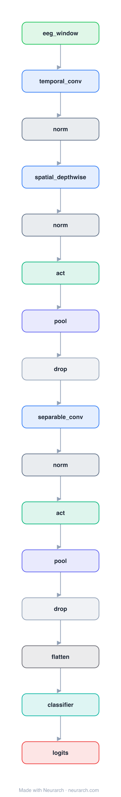

# EEGNet

The compact CNN that became the universal baseline for EEG brain-computer interfaces: temporal conv, depthwise spatial conv across electrodes, separable conv, all in a few thousand parameters.

## Model URLs

| Where | URL |
|---|---|
| **Open in Neurarch** (live, editable graph) | https://www.neurarch.com/?import=https://raw.githubusercontent.com/neurarch-ai/awesome-llm-model-zoo/main/architectures/eegnet/model.json |
| Paper (Lawhern et al. 2018) | https://arxiv.org/abs/1611.08024 |
| GitHub | https://github.com/vlawhern/arl-eegmodels |

## Architecture

<b>Layer-by-layer (16 nodes)</b>

| # | Layer | Type | Params |
|---|---|---|---|
| 1 | eeg_window | `input` | shape: [1, 22, 1000] |
| 2 | temporal_conv | `conv2d` | outChannels: 8, kernelSize: [1, 64], stride: 1, padding: [0, 32], inChannels: 1 |
| 3 | norm | `batchNorm` | normalizedShape: 8 |
| 4 | spatial_depthwise | `depthwiseConv2d` | outChannels: 16, kernelSize: [22, 1], stride: 1, padding: 0, depthMultiplier: 2 |
| 5 | norm | `batchNorm` | normalizedShape: 16 |
| 6 | act | `elu` |   |
| 7 | pool | `avgpool2d` | kernelSize: [1, 4], stride: [1, 4] |
| 8 | drop | `dropout` | p: 0.25 |
| 9 | separable_conv | `separableConv2d` | outChannels: 16, kernelSize: [1, 16], stride: 1, padding: [0, 8] |
| 10 | norm | `batchNorm` | normalizedShape: 16 |
| 11 | act | `elu` |   |
| 12 | pool | `avgpool2d` | kernelSize: [1, 8], stride: [1, 8] |
| 13 | drop | `dropout` | p: 0.25 |
| 14 | flatten | `flatten` |   |
| 15 | classifier | `linear` | outFeatures: 4, inFeatures: NaN |
| 16 | logits | `output` |   |

This graph ships in Neurarch's in-app template library; the copy here passes shape propagation with zero errors.

## Design notes

- Depthwise convolution across the electrode dimension learns spatial filters per temporal filter, mirroring classical CSP pipelines.
- Small enough to train on single-subject EEG datasets (hundreds of trials), which is the whole point.

## Files

| File | What it is |
|---|---|
| [`model.json`](model.json) | The Neurarch graph. Shape-validated; open it at [neurarch.com](https://www.neurarch.com/) to edit or export training code. |
| [`assets/diagram.svg`](assets/diagram.svg) | Vector diagram (papers, slides). |
| [`assets/diagram.png`](assets/diagram.png) | Raster diagram (renders everywhere). |
