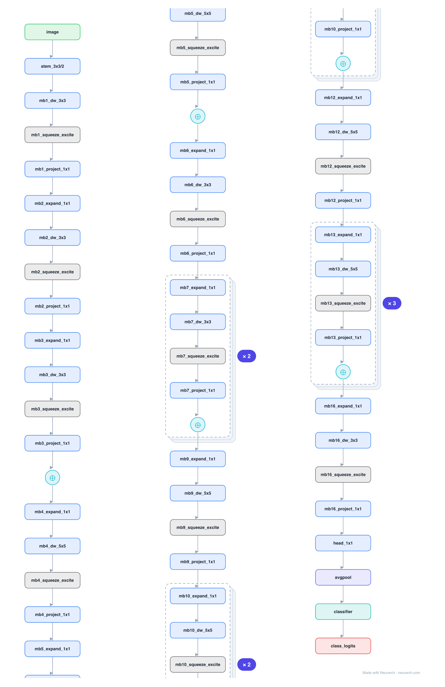

# EfficientNet-B0

The baseline of the EfficientNet family: MBConv blocks (mobile inverted bottleneck with a squeeze-and-excite gate) discovered by neural architecture search, then compound-scaled into B1-B7. The accuracy-per-FLOP reference for years.

## Model URLs

| Where | URL |
|---|---|
| **Open in Neurarch** (live, editable graph) | https://www.neurarch.com/?import=https://raw.githubusercontent.com/neurarch-ai/awesome-llm-model-zoo/main/architectures/efficientnet-b0/model.json |
| Paper (Tan and Le 2019) | https://arxiv.org/abs/1905.11946 |
| Hugging Face | https://huggingface.co/google/efficientnet-b0 |

## Architecture

*Identical repeated blocks are folded into one representative block with a `× N` badge, so the whole architecture fits on screen. `model.json` keeps all 78 nodes (open it in Neurarch to see and edit every layer). Vector: [diagram.svg](assets/diagram.svg).*

| Hyperparameter | Value |
|---|---|
| Type | Efficient convolutional network |
| Parameters | 5.3M |
| Stem | 3x3/2 conv (32) |
| Body | 16 MBConv blocks (7 stages) |
| MBConv | expand 1x1 → depthwise → squeeze-excite → project 1x1 |
| Head | 1x1 conv (1280) → GAP → FC-1000 |
| Found by | Compound-scaling NAS |

`model.json` is the full graph, hand-built against the official config.json.

## Parameter check

Neurarch's per-layer parameter estimate over this graph: **8.4M**.

## Design notes

- MBConv = MobileNetV2's inverted residual plus a squeeze-and-excite channel-attention block inside each one.
- B0 was found by NAS; B1-B7 just scale depth, width, and resolution together by a single compound coefficient.
- Compare with [mobilenet-v2](../mobilenet-v2/) (same inverted-residual core, no SE) and [resnet-50](../resnet-50/) (the non-inverted predecessor).

## Files

| File | What it is |
|---|---|
| [`model.json`](model.json) | The full Neurarch graph (every layer, real dimensions). Open it at [neurarch.com](https://www.neurarch.com/) to edit or export training code. |
| [`assets/diagram.svg`](assets/diagram.svg) / [`.png`](assets/diagram.png) | Architecture diagram (repeated blocks folded with a `× N` badge). |

**License:** Apache 2.0. The graph and diagrams here describe the architecture; any referenced weights remain under the upstream license.
