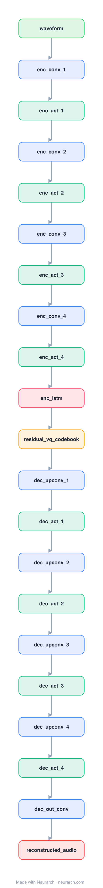

# EnCodec

A neural audio codec: a convolutional encoder downsamples the waveform, residual vector quantization turns the latents into a stack of discrete codes, and a mirrored decoder reconstructs the audio. The thing that turns continuous audio into tokens an LLM can model.

## Model URLs

| Where | URL |
|---|---|
| **Open in Neurarch** (live, editable graph) | https://www.neurarch.com/?import=https://raw.githubusercontent.com/neurarch-ai/awesome-llm-model-zoo/main/architectures/encodec/model.json |
| Paper (Defossez et al. 2022) | https://arxiv.org/abs/2210.13438 |
| Hugging Face | https://huggingface.co/facebook/encodec_24khz |

## Architecture

*The full graph, all 21 nodes. Vector: [diagram.svg](assets/diagram.svg).*

| Hyperparameter | Value |
|---|---|
| Type | Neural audio codec (autoencoder + quantizer) |
| Encoder | Strided Conv1D stack (downsamples the waveform) |
| Bottleneck | Residual vector quantization (discrete codes) |
| Decoder | Mirrored transposed-conv stack (reconstructs audio) |
| Use | The audio tokenizer behind audio LLMs (MusicGen, ...) |

`model.json` is the full graph, hand-built against the official config.json.

## Parameter check

Neurarch's per-layer parameter estimate over this graph: **4.7M**.

## Design notes

- Residual vector quantization (RVQ): a cascade of codebooks where each quantizes the residual the previous one left, so a few codebooks reconstruct audio at very low bitrate.
- The encoder/decoder are SEANet-style strided conv stacks with an LSTM in the bottleneck; the discrete codes are what MusicGen / audio LLMs actually generate.
- Conceptually the audio analogue of a VAE+codebook (VQ-VAE) for images; it is why "audio language model" is even possible.

## Files

| File | What it is |
|---|---|
| [`model.json`](model.json) | The full Neurarch graph (every layer, real dimensions). Open it at [neurarch.com](https://www.neurarch.com/) to edit or export training code. |
| [`assets/diagram.svg`](assets/diagram.svg) / [`.png`](assets/diagram.png) | Architecture diagram (repeated blocks folded with a `× N` badge). |

**License:** MIT. The graph and diagrams here describe the architecture; any referenced weights remain under the upstream license.
