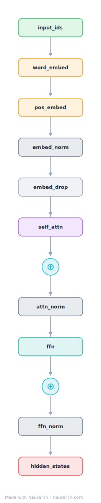

# ERNIE 3.0 Base (Chinese)

Baidu's workhorse Chinese encoder, the base-size distillation of the ERNIE 3.0 family. BERT-base shape with a larger vocabulary, 2048-token positions, and knowledge-enhanced pretraining.

## Model URLs

| Where | URL |
|---|---|
| **Open in Neurarch** (live, editable graph) | https://www.neurarch.com/?import=https://raw.githubusercontent.com/neurarch-ai/neurarch-model-zoo/main/architectures/ernie-3.0-base-zh/model.json |
| Hugging Face | https://huggingface.co/nghuyong/ernie-3.0-base-zh |
| GitHub | https://github.com/PaddlePaddle/PaddleNLP/tree/develop/model_zoo/ernie-3.0 |

## Architecture

*Compact view: one block expanded. The full graph below is what `model.json` holds.*

<b>Full graph: 51 nodes (click to expand)</b>

| Hyperparameter | Value |
|---|---|
| Type | Bidirectional encoder (BERT family) |
| Parameters | 118M |
| Layers | 12 |
| Hidden size | 768 |
| Attention | Multi-head: 12 heads |
| FFN | Dense, 3,072, GeLU |
| Normalization | LayerNorm, post-norm |
| Positions | Absolute learned, max 2,048 |
| Vocabulary | 40,000 |

`model.json` is the full 12-layer graph, produced with the same import path the Neurarch app uses for "load from Hugging Face", with all hyperparameters from the official `config.json`.

## Parameter check

Neurarch's per-layer parameter estimate over this graph: **115.8M**.
Deviation from the authoritative count (118.0M): **-1.9%**.

> The graph sum lands ~2% under the official figure, which includes ERNIE's task-type embedding table that the importer does not model.

## Design notes

- BERT-base shape with two ERNIE twists: a 40000-token vocabulary (almost 2x BERT's Chinese vocab) and a 2048 max position, four times BERT's 512.
- Adds a task-type embedding alongside token and position embeddings, a remnant of ERNIE 3.0's multi-task universal-representation pretraining.
- Distilled from the 10B ERNIE 3.0 Titan teacher; the base model is what ships for practical NLU.
- Official weights are Paddle-native; the linked HF checkpoint is the standard PyTorch conversion by nghuyong.

## Files

| File | What it is |
|---|---|
| [`model.json`](model.json) | The full Neurarch graph (every layer, real dimensions). Open it at [neurarch.com](https://www.neurarch.com/) to edit or export training code. |
| [`assets/diagram.svg`](assets/diagram.svg) / [`.png`](assets/diagram.png) | Diagram of the full graph. |
| [`assets/block.svg`](assets/block.svg) / [`.png`](assets/block.png) | Compact one-block explainer view. |

**License:** Apache 2.0 (PaddleNLP). The graph and diagrams here describe the architecture; the model weights remain under the upstream license.
