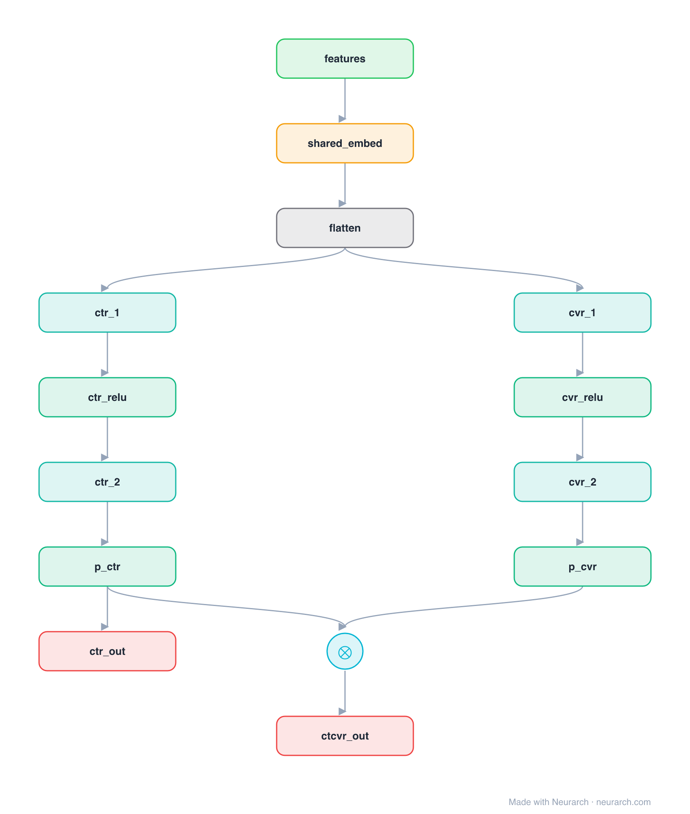

# ESMM

Entire Space Multi-task Model: conversion-rate models trained only on clicked impressions suffer sample-selection bias and data sparsity. ESMM trains a pCTR and a pCVR tower (sharing embeddings) over every impression, supervising the product pCTCVR = pCTR x pCVR, so the CVR tower learns from the full space without ever needing click-only labels.

## Model URLs

| Where | URL |
|---|---|
| **Open in Neurarch** (live, editable graph) | https://www.neurarch.com/?import=https://raw.githubusercontent.com/neurarch-ai/awesome-llm-model-zoo/main/architectures/esmm/model.json |
| Paper (Ma et al. 2018) | https://arxiv.org/abs/1804.07931 |

## Architecture

*The full graph, all 14 nodes. Vector: [diagram.svg](assets/diagram.svg).*

| Hyperparameter | Value |
|---|---|
| Type | CVR / post-click conversion |
| Towers | Shared embeddings feed a pCTR and a pCVR tower |
| Objective | pCTCVR = pCTR x pCVR, supervised over all impressions |
| Key idea | Train CVR over the entire space to kill sample-selection bias |

`model.json` is the full graph, hand-built against the official config.json.

## Parameter check

This entry is a **structural reference**: its parameter mix is not recomputed by the per-layer estimator, so it carries no deviation gate. See the hyperparameter table above for the authoritative total / active parameter counts.

## Design notes

- The two towers share one embedding table, which also eases the data-sparsity problem for the CVR tower.
- pCVR is never supervised directly: the losses are on pCTR and on the pCTCVR product, both defined over all impressions.
- A staple of e-commerce ads ranking; pairs with the multi-task rankers [mmoe](../mmoe/) and [ple](../ple/).

## Files

| File | What it is |
|---|---|
| [`model.json`](model.json) | The full Neurarch graph (every layer, real dimensions). Open it at [neurarch.com](https://www.neurarch.com/) to edit or export training code. |
| [`assets/diagram.svg`](assets/diagram.svg) / [`.png`](assets/diagram.png) | Architecture diagram (repeated blocks folded with a `× N` badge). |
