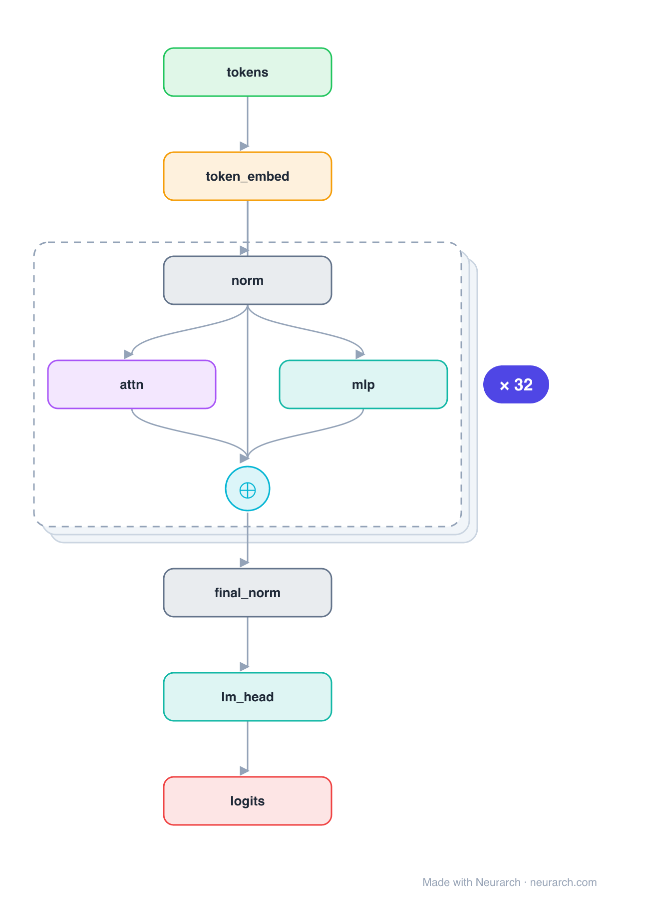

# Falcon-7B

TII's 2023 open LLM, briefly the top of the Open LLM Leaderboard. Two architecture bets define it: multi-query attention (all 71 query heads share a single key/value head, shrinking the KV cache ~70x) and a parallel residual block where one LayerNorm feeds attention and the MLP at once, both summed back.

## Model URLs

| Where | URL |
|---|---|
| **Open in Neurarch** (live, editable graph) | https://www.neurarch.com/?import=https://raw.githubusercontent.com/neurarch-ai/awesome-llm-model-zoo/main/architectures/falcon-7b/model.json |
| Paper (The Falcon Series) | https://arxiv.org/abs/2311.16867 |
| Hugging Face | https://huggingface.co/tiiuae/falcon-7b |

## Architecture

*Identical repeated blocks are folded into one representative block with a `× N` badge, so the whole architecture fits on screen. `model.json` keeps all 133 nodes (open it in Neurarch to see and edit every layer). Vector: [diagram.svg](assets/diagram.svg).*

| Hyperparameter | Value |
|---|---|
| Type | Decoder-only transformer (causal LM) |
| Parameters | 7.2B |
| Layers | 32 |
| Hidden size | 4,544 |
| Attention | Multi-query: 71 query heads, 1 KV head, head dim 64 |
| FFN | GELU MLP, intermediate size 18,176 (4x) |
| Residual | Parallel: one LayerNorm feeds attention and MLP, both summed |
| Normalization | LayerNorm, pre-norm |
| Positions | RoPE |
| Vocabulary | 65,024 |
| Max context | 2,048 |

`model.json` is the full graph, hand-built against the official config.json.

## Parameter check

Neurarch's per-layer parameter estimate over this graph: **7.22B**.
Deviation from the authoritative count (7.22B): **-0.0%**.

## Design notes

- Multi-query attention: 71 query heads but only 1 KV head, the extreme end of the MHA -> GQA -> MQA spectrum.
- Parallel attention + MLP (GPT-NeoX style): both consume the same normed input and add into the residual, saving a norm per layer.
- GELU MLP (not gated SwiGLU) and no biases anywhere; RoPE for positions.

## Files

| File | What it is |
|---|---|
| [`model.json`](model.json) | The full Neurarch graph (every layer, real dimensions). Open it at [neurarch.com](https://www.neurarch.com/) to edit or export training code. |
| [`assets/diagram.svg`](assets/diagram.svg) / [`.png`](assets/diagram.png) | Architecture diagram (repeated blocks folded with a `× N` badge). |

**License:** Apache 2.0. The graph and diagrams here describe the architecture; any referenced weights remain under the upstream license.
