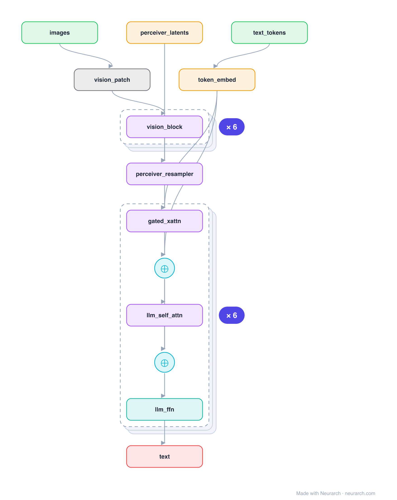

# Flamingo

The visual-language model that handles interleaved images and text and does few-shot in-context learning. A Perceiver Resampler compresses image features to a few tokens, and gated cross-attention layers spliced into a frozen LLM let the text attend to them.

## Model URLs

| Where | URL |
|---|---|
| **Open in Neurarch** (live, editable graph) | https://www.neurarch.com/?import=https://raw.githubusercontent.com/neurarch-ai/awesome-llm-model-zoo/main/architectures/flamingo/model.json |
| Paper (Alayrac et al. 2022) | https://arxiv.org/abs/2204.14198 |

## Architecture

*Identical repeated blocks are folded into one representative block with a `× N` badge, so the whole architecture fits on screen. `model.json` keeps all 43 nodes (open it in Neurarch to see and edit every layer). Vector: [diagram.svg](assets/diagram.svg).*

| Hyperparameter | Value |
|---|---|
| Type | Few-shot visual language model |
| Vision encoder | Frozen (NFNet / CLIP) |
| Resampler | Perceiver: learned latents cross-attend vision features → fixed tokens |
| LLM | Frozen, with gated cross-attention layers inserted between blocks |
| Key idea | Interleave image + text, tanh-gated x-attn so init = pure LLM |

`model.json` is the full graph, hand-built against the official config.json.

## Parameter check

Neurarch's per-layer parameter estimate over this graph: **1.90B**.

## Design notes

- Perceiver Resampler: a fixed set of learned latents cross-attend the variable-length vision features, so any image (or video) becomes a constant 64 visual tokens.
- tanh gating: the inserted cross-attention starts at zero contribution (gate = 0), so the model begins as exactly the frozen LLM and learns to use vision gradually, which is what made training stable.
- The ancestor of the "freeze the LLM, splice in vision via cross-attention" branch of MLLMs; contrast with the prefix-token approach of [llava-1.5-7b](../llava-1.5-7b/).

## Files

| File | What it is |
|---|---|
| [`model.json`](model.json) | The full Neurarch graph (every layer, real dimensions). Open it at [neurarch.com](https://www.neurarch.com/) to edit or export training code. |
| [`assets/diagram.svg`](assets/diagram.svg) / [`.png`](assets/diagram.png) | Architecture diagram (repeated blocks folded with a `× N` badge). |

**License:** Research (weights not released; open re-impl: OpenFlamingo). The graph and diagrams here describe the architecture; any referenced weights remain under the upstream license.
