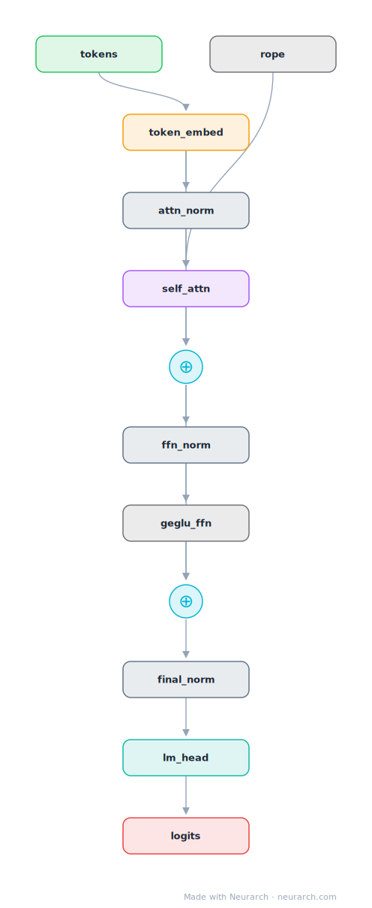

# Gemma 4 12B

The 12B of Google's Gemma 4 generation, the strongest permissively-distributed dense model of the June 2026 wave. Wide 256-dim heads, 5:1 local:global attention, and a 262K vocabulary.

## Model URLs

| Where | URL |
|---|---|
| **Open in Neurarch** (live, editable graph) | https://www.neurarch.com/?import=https://raw.githubusercontent.com/neurarch-ai/neurarch-model-zoo/main/architectures/gemma-4-12b/model.json |
| Hugging Face | https://huggingface.co/google/gemma-4-12b |
| GitHub | https://github.com/google-deepmind/gemma |

## Architecture

| Hyperparameter | Value |
|---|---|
| Type | Decoder-only transformer (causal LM) |
| Parameters | 12B |
| Layers | 48 |
| Hidden size | 3840 |
| Attention | Grouped-query: 16 query heads, 8 KV heads |
| Head dim | 256 |
| FFN | GeGLU, hidden size 15,360 |
| Normalization | RMSNorm, pre-norm |
| Positions | RoPE; 5:1 local(1024-window):global attention layers (40 sliding, 8 full, verified from config) |
| Vocabulary | 262,144 |
| Max context | 262,144 |

The diagram and `model.json` show the full forward path with one of the 48 identical decoder blocks expanded (the stack repeats x48). All hyperparameters are taken from the official `config.json` on Hugging Face.

## Design notes

- Hyperparameters read directly from the June 2026 config.json (gemma4_unified_text): this entry tracks the release, not secondhand writeups.
- Oversized heads: 16 heads of dim 256 (4096-dim attention over 3840 hidden), continuing the Gemma trademark of few-but-wide heads.
- 5:1 local-to-global attention with a 1024-token window keeps the 262144-token context affordable; only 8 of 48 layers see the full sequence.
- GeGLU FFN at 15360 (4x hidden) and the huge 262144-token SentencePiece vocabulary; "unified" model_type with a built-in vision encoder (text stack shown here).

## Files

| File | What it is |
|---|---|
| [`model.json`](model.json) | The Neurarch graph. Shape-validated; open it at [neurarch.com](https://www.neurarch.com/) to edit or export training code. |
| [`assets/diagram.svg`](assets/diagram.svg) | Vector diagram (papers, slides). |
| [`assets/diagram.png`](assets/diagram.png) | Raster diagram (renders everywhere). |

**License:** Gemma Terms of Use. The graph and diagrams here describe the architecture; the model weights remain under the upstream license.
