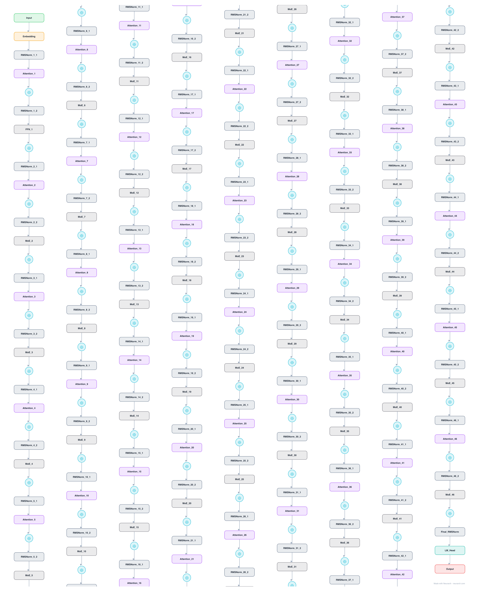

# GLM-4.5-Air

Zhipu AI's agent-focused MoE in its deployable Air size. Distinctive for spending parameters on attention (96 heads, 3x hidden) while keeping experts slim, the opposite allocation from most 2025 MoEs.

## Model URLs

| Where | URL |
|---|---|
| **Open in Neurarch** (live, editable graph) | https://www.neurarch.com/?import=https://raw.githubusercontent.com/neurarch-ai/awesome-llm-model-zoo/main/architectures/glm-4.5-air/model.json |
| Hugging Face | https://huggingface.co/zai-org/GLM-4.5-Air |
| GitHub | https://github.com/zai-org/GLM-4.5 |

## Architecture

*Identical repeated blocks are folded into one representative block with a `× N` badge, so the whole architecture fits on screen. `model.json` keeps all 281 nodes (open it in Neurarch to see and edit every layer). Vector: [diagram.svg](assets/diagram.svg).*

| Hyperparameter | Value |
|---|---|
| Type | Decoder-only transformer, sparse MoE (causal LM) |
| Parameters | 106B total, 12B active |
| Layers | 46 |
| Hidden size | 4096 |
| Attention | Grouped-query: 96 query heads, 8 KV heads |
| Head dim | 128 |
| FFN | MoE: 128 routed experts, top-8 + 1 shared, expert dim 1,408; first 1 layer dense (10,944) |
| Normalization | RMSNorm, pre-norm |
| Positions | RoPE (rotary dim 64) |
| Vocabulary | 151,552 |
| Max context | 131,072 |

`model.json` is the full 46-layer graph, produced with the same import path the Neurarch app uses for "load from Hugging Face", with all hyperparameters from the official `config.json`.

## Parameter check

Neurarch's per-layer parameter estimate over this graph: **106.85B**.
Hugging Face safetensors metadata reports **110.47B** for the real weights.
Deviation from the authoritative count (110.47B): **-3.3%**.

## Design notes

- Wide attention: 96 query heads of dim 128 give a 12288-dim attention space over a 4096 hidden size (3x), an unusually attention-heavy budget the GLM-4.5 report credits for reasoning performance.
- GQA 96:8 with partial RoPE (half of each head), plus QKV bias (attention_bias = true), a Qwen2-style touch the rest of the 2025 wave dropped.
- 128 fine-grained experts, top-8 routing, 1 shared expert, slim 1408-dim experts; first layer dense at 10944.
- The "Air" tier of the GLM-4.5 agentic line: 106B total but only 12B active, sized to run on a single high-end node.

## Files

| File | What it is |
|---|---|
| [`model.json`](model.json) | The full Neurarch graph (every layer, real dimensions). Open it at [neurarch.com](https://www.neurarch.com/) to edit or export training code. |
| [`assets/diagram.svg`](assets/diagram.svg) / [`.png`](assets/diagram.png) | Architecture diagram (repeated blocks folded with a `× N` badge). |

**License:** MIT. The graph and diagrams here describe the architecture; the model weights remain under the upstream license.
