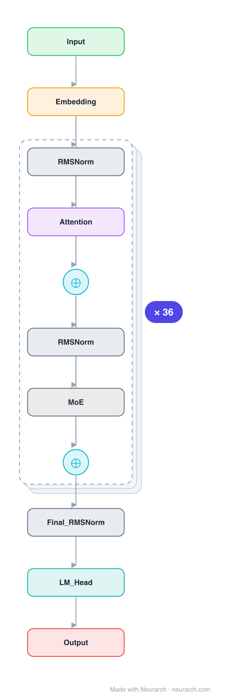

# gpt-oss-120b

The larger of OpenAI's two 2025 open-weight MoEs, sized to run on a single 80GB GPU at MXFP4. Same recipe as [gpt-oss-20b](../gpt-oss-20b/) but 128 experts and 36 layers: 117B total, 5.1B active.

## Model URLs

| Where | URL |
|---|---|
| **Open in Neurarch** (live, editable graph) | https://www.neurarch.com/?import=https://raw.githubusercontent.com/neurarch-ai/awesome-llm-model-zoo/main/architectures/gpt-oss-120b/model.json |
| GitHub | https://github.com/openai/gpt-oss |
| Hugging Face | https://huggingface.co/openai/gpt-oss-120b |

## Architecture

*Identical repeated blocks are folded into one representative block with a `× N` badge, so the whole architecture fits on screen. `model.json` keeps all 221 nodes (open it in Neurarch to see and edit every layer). Vector: [diagram.svg](assets/diagram.svg).*

| Hyperparameter | Value |
|---|---|
| Type | Decoder-only transformer, sparse MoE (causal LM) |
| Parameters | 117B total, 5.1B active |
| Layers | 36 |
| Hidden size | 2880 |
| Attention | GQA 64:8, head dim 64 |
| FFN | MoE: 128 experts, top-4 (no shared) |
| Normalization | RMSNorm, pre-norm |
| Positions | RoPE + YaRN; alternating sliding-window (128) and full attention |
| Vocabulary | 201,088 |
| Max context | 131,072 |

`model.json` is the full graph, produced with the same import path the Neurarch app uses for "load from Hugging Face".

## Parameter check

Neurarch's per-layer parameter estimate over this graph: **116.79B**.
Hugging Face safetensors metadata reports **120.41B** for the real weights.
Deviation from the authoritative count (120.41B): **-3.0%**.

## Design notes

- 128 experts, top-4 routed, no shared expert; 5.1B of 117B parameters active per token.
- Alternating attention: odd layers a 128-token sliding window, even layers full attention, plus learned attention-sink logits.
- Ships MXFP4-quantized; trained with the harmony response format for tool use and chain-of-thought.

## Files

| File | What it is |
|---|---|
| [`model.json`](model.json) | The full Neurarch graph (every layer, real dimensions). Open it at [neurarch.com](https://www.neurarch.com/) to edit or export training code. |
| [`assets/diagram.svg`](assets/diagram.svg) / [`.png`](assets/diagram.png) | Architecture diagram (repeated blocks folded with a `× N` badge). |

**License:** Apache 2.0. The graph and diagrams here describe the architecture; any referenced weights remain under the upstream license.
