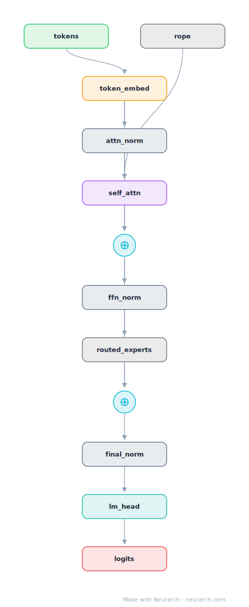

# gpt-oss-20b

The 20B mixture-of-experts OpenAI released under Apache 2.0 in 2025. Small sliding windows, tiny heads, aggressive MoE sparsity: an inference-economics architecture through and through.

## Model URLs

| Where | URL |
|---|---|
| **Open in Neurarch** (live, editable graph) | https://www.neurarch.com/?import=https://raw.githubusercontent.com/neurarch-ai/neurarch-model-zoo/main/architectures/gpt-oss-20b/model.json |
| Hugging Face | https://huggingface.co/openai/gpt-oss-20b |
| GitHub | https://github.com/openai/gpt-oss |

## Architecture

| Hyperparameter | Value |
|---|---|
| Type | Decoder-only transformer, sparse MoE (causal LM) |
| Parameters | 21B total, 3.6B active |
| Layers | 24 |
| Hidden size | 2880 |
| Attention | Grouped-query: 64 query heads, 8 KV heads |
| Head dim | 64 |
| FFN | MoE: 32 routed experts, top-4, expert dim 2,880 |
| Normalization | RMSNorm, pre-norm |
| Positions | RoPE + YaRN; layers alternate sliding-window (128) and full attention 1:1 |
| Vocabulary | 201,088 |
| Max context | 131,072 |

The diagram and `model.json` show the full forward path with one of the 24 identical decoder blocks expanded (the stack repeats x24). All hyperparameters are taken from the official `config.json` on Hugging Face.

## Design notes

- OpenAI's first open-weight release since GPT-2: a 24-layer MoE with 32 experts, top-4 routed, no shared expert, 3.6B active of 21B total.
- Alternating attention: odd layers use a 128-token sliding window, even layers full attention (verified from config layer_types, 12 of each), plus learned attention-sink logits per head.
- Attention bias on, 64 small heads of dim 64 over a 2880 hidden size, and a 201088-token o200k_harmony vocabulary.
- Ships MXFP4-quantized so the 20B fits in 16GB; trained with the harmony response format for tool use and CoT.

## Files

| File | What it is |
|---|---|
| [`model.json`](model.json) | The Neurarch graph. Shape-validated; open it at [neurarch.com](https://www.neurarch.com/) to edit or export training code. |
| [`assets/diagram.svg`](assets/diagram.svg) | Vector diagram (papers, slides). |
| [`assets/diagram.png`](assets/diagram.png) | Raster diagram (renders everywhere). |

**License:** Apache 2.0. The graph and diagrams here describe the architecture; the model weights remain under the upstream license.
