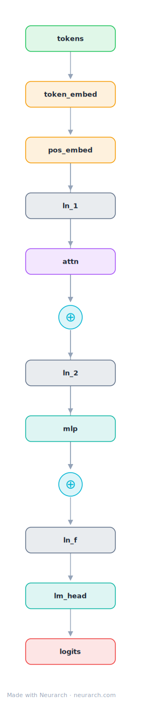
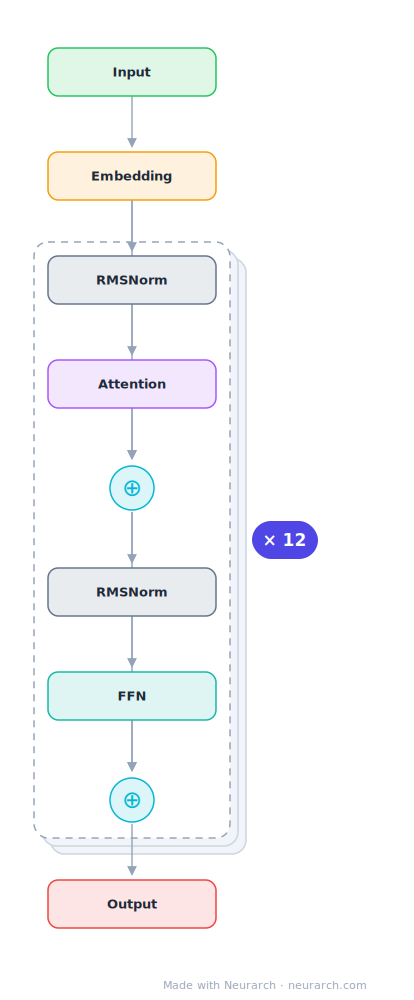

# GPT-2 Small

The 124M-parameter GPT-2 configuration from OpenAI, the classic decoder-only transformer and the reference point most later LLM architectures are described against.

## Model URLs

| Where | URL |
|---|---|
| **Open in Neurarch** (live, editable graph) | https://www.neurarch.com/?import=https://raw.githubusercontent.com/neurarch-ai/neurarch-model-zoo/main/architectures/gpt2-small/model.json |
| Hugging Face | https://huggingface.co/openai-community/gpt2 |
| GitHub | https://github.com/openai/gpt-2 |

## Architecture

*Compact view: one block expanded. The full graph below is what `model.json` holds.*

<b>Full graph: 75 nodes (click to expand)</b>

| Hyperparameter | Value |
|---|---|
| Type | Decoder-only transformer (causal LM) |
| Parameters | 124M |
| Layers | 12 |
| Hidden size | 768 |
| Attention | Multi-head: 12 heads (causal) |
| FFN | Dense MLP, 3072, GeLU |
| Normalization | LayerNorm, pre-norm |
| Positions | Learned absolute, max 1024 |
| Vocabulary | 50,257 |
| Max context | 1,024 |

`model.json` is the full graph, produced with the same import path the Neurarch app uses for "load from Hugging Face".

## Parameter check

Neurarch's per-layer parameter estimate over this graph: **123.6M**.
Hugging Face safetensors metadata reports **137.0M** for the real weights.
Deviation from the authoritative count (124.4M): **-0.6%**.

> GPT-2 ties the LM head to the token embedding; the official count is 124M unique parameters.

## Design notes

- Pre-norm placement (LayerNorm before attention and MLP) plus a final ln_f, the detail that separates GPT-2 from the original post-norm Transformer.
- Learned absolute position embeddings added to token embeddings, no RoPE; context is hard-capped at 1024 tokens.
- Dense GeLU MLP at 4x hidden (3072), the ratio later Llama-style models replaced with ~2.7x SwiGLU.
- LM head shares weights with the token embedding (weight tying).

## Files

| File | What it is |
|---|---|
| [`model.json`](model.json) | The full Neurarch graph (every layer, real dimensions). Open it at [neurarch.com](https://www.neurarch.com/) to edit or export training code. |
| [`assets/diagram.svg`](assets/diagram.svg) / [`.png`](assets/diagram.png) | Diagram of the full graph. |
| [`assets/block.svg`](assets/block.svg) / [`.png`](assets/block.png) | Compact one-block explainer view. |

**License:** MIT. The graph and diagrams here describe the architecture; any referenced weights remain under the upstream license.
