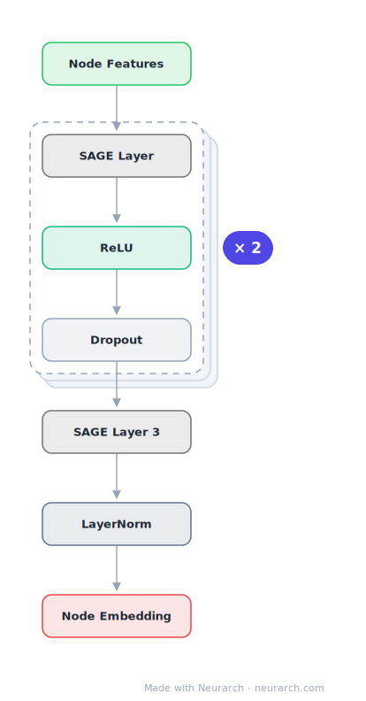

# GraphSAGE Recommender

Inductive node embeddings by sampling and aggregating neighborhoods, wired here as a recommendation retrieval encoder. The architecture PinSage scaled to billions of pins.

## Model URLs

| Where | URL |
|---|---|
| **Open in Neurarch** (live, editable graph) | https://www.neurarch.com/?import=https://raw.githubusercontent.com/neurarch-ai/neurarch-model-zoo/main/architectures/graph-sage-rec/model.json |
| Paper (Hamilton et al. 2017) | https://arxiv.org/abs/1706.02216 |

## Architecture

<b>Layer-by-layer (10 nodes)</b>

| # | Layer | Type | Params |
|---|---|---|---|
| 1 | Node Features | `input` | shape: [128] |
| 2 | SAGE Layer 1 | `graphSAGE` | inChannels: 128, outChannels: 256, aggregator: mean |
| 3 | ReLU | `relu` |   |
| 4 | Dropout | `dropout` | p: 0.2 |
| 5 | SAGE Layer 2 | `graphSAGE` | inChannels: 256, outChannels: 256, aggregator: mean |
| 6 | ReLU | `relu` |   |
| 7 | Dropout | `dropout` | p: 0.2 |
| 8 | SAGE Layer 3 | `graphSAGE` | inChannels: 256, outChannels: 128, aggregator: mean |
| 9 | LayerNorm | `layerNorm` | normalizedShape: [128] |
| 10 | Node Embedding | `output` |   |

This graph ships in Neurarch's in-app template library; the copy here passes shape propagation with zero errors.

## Design notes

- Inductive, not transductive: it embeds unseen nodes by aggregating their neighbors, which is what makes it production-viable for fresh inventory.
- Sample-and-aggregate (rather than full-graph convolution) is the trick that bounds compute per node.

## Files

| File | What it is |
|---|---|
| [`model.json`](model.json) | The Neurarch graph. Shape-validated; open it at [neurarch.com](https://www.neurarch.com/) to edit or export training code. |
| [`assets/diagram.svg`](assets/diagram.svg) | Vector diagram (papers, slides). |
| [`assets/diagram.png`](assets/diagram.png) | Raster diagram (renders everywhere). |
