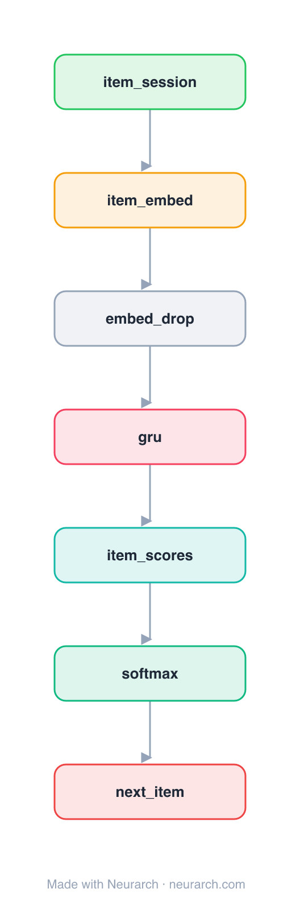

# GRU4Rec

The paper that brought recurrent networks to session-based recommendation: a GRU consumes the sequence of clicks in an anonymous session and scores the next item. The RNN baseline every later sequential-recsys model compares against.

## Model URLs

| Where | URL |
|---|---|
| **Open in Neurarch** (live, editable graph) | https://www.neurarch.com/?import=https://raw.githubusercontent.com/neurarch-ai/awesome-llm-model-zoo/main/architectures/gru4rec/model.json |
| Paper (Hidasi et al. 2016) | https://arxiv.org/abs/1511.06939 |

## Architecture

*The full graph, all 7 nodes. Vector: [diagram.svg](assets/diagram.svg).*

| Hyperparameter | Value |
|---|---|
| Type | Session-based recommendation |
| Embedding | Item embedding |
| Backbone | GRU over the click sequence |
| Head | Linear to item catalogue → softmax |
| Key idea | RNN for anonymous session sequences |

`model.json` is the full graph, hand-built against the official config.json.

## Parameter check

Neurarch's per-layer parameter estimate over this graph: **10.1M**.

## Design notes

- Built for session data (no long-term user profile): the GRU's hidden state is the running session intent.
- Introduced session-parallel mini-batching and a ranking loss (BPR / TOP1) tailored to recommendation.
- The recurrent counterpart to the attention-based [sasrec](../sasrec/) and [bert4rec](../bert4rec/).

## Files

| File | What it is |
|---|---|
| [`model.json`](model.json) | The full Neurarch graph (every layer, real dimensions). Open it at [neurarch.com](https://www.neurarch.com/) to edit or export training code. |
| [`assets/diagram.svg`](assets/diagram.svg) / [`.png`](assets/diagram.png) | Architecture diagram (repeated blocks folded with a `× N` badge). |
