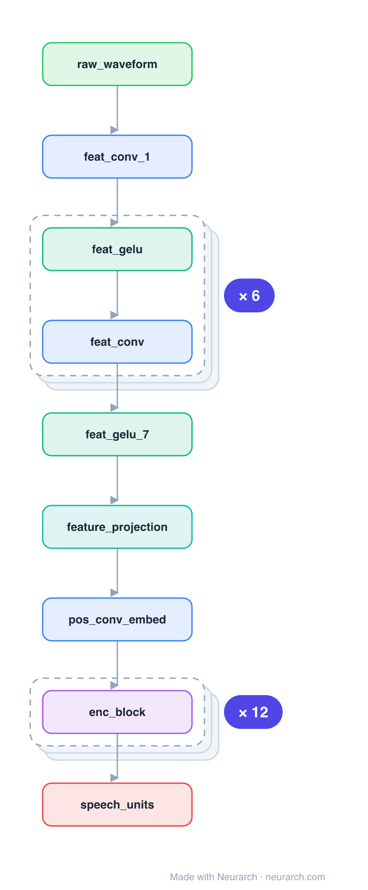

# HuBERT base

Architecturally a twin of Wav2Vec2 (conv feature extractor + Transformer), but pretrained differently: instead of contrastive masking it predicts the cluster ID (from offline k-means on features) of masked frames, a BERT-style masked-prediction objective for speech.

## Model URLs

| Where | URL |
|---|---|
| **Open in Neurarch** (live, editable graph) | https://www.neurarch.com/?import=https://raw.githubusercontent.com/neurarch-ai/awesome-llm-model-zoo/main/architectures/hubert-base/model.json |
| Paper (Hsu et al. 2021) | https://arxiv.org/abs/2106.07447 |
| Hugging Face | https://huggingface.co/facebook/hubert-base-ls960 |

## Architecture

*Identical repeated blocks are folded into one representative block with a `× N` badge, so the whole architecture fits on screen. `model.json` keeps all 30 nodes (open it in Neurarch to see and edit every layer). Vector: [diagram.svg](assets/diagram.svg).*

| Hyperparameter | Value |
|---|---|
| Type | Self-supervised speech encoder |
| Parameters | 95M |
| Feature extractor | 7 Conv1D layers (raw waveform) |
| Encoder | 12 Transformer blocks, 768 hidden |
| Pretraining | Predict offline k-means cluster IDs of masked frames |

`model.json` is the full graph, hand-built against the official config.json.

## Parameter check

Neurarch's per-layer parameter estimate over this graph: **165.7M**.

## Design notes

- Same backbone as [wav2vec2-base](../wav2vec2-base/); the contribution is the training target, a discrete unit from iterative k-means clustering rather than a contrastive loss.
- That "predict the masked unit" recipe (closer to masked-LM) ended up underpinning a lot of modern speech and audio-LLM systems.

## Files

| File | What it is |
|---|---|
| [`model.json`](model.json) | The full Neurarch graph (every layer, real dimensions). Open it at [neurarch.com](https://www.neurarch.com/) to edit or export training code. |
| [`assets/diagram.svg`](assets/diagram.svg) / [`.png`](assets/diagram.png) | Architecture diagram (repeated blocks folded with a `× N` badge). |

**License:** Apache 2.0. The graph and diagrams here describe the architecture; any referenced weights remain under the upstream license.
