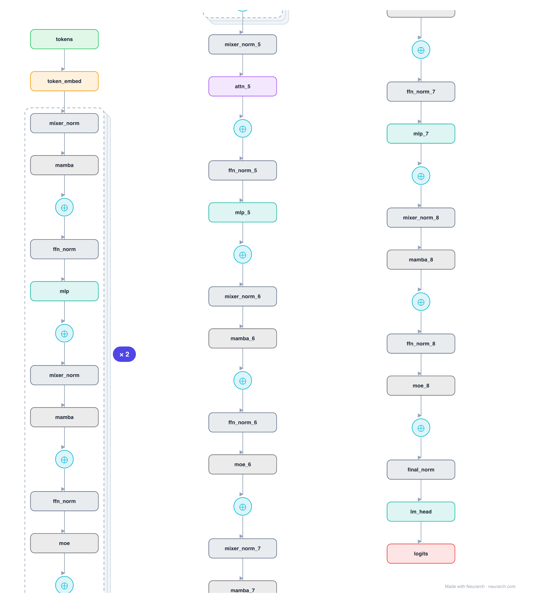

# Jamba

AI21's 2024 hybrid: the first production-scale model to interleave Mamba state-space mixers with Transformer attention, plus MoE. Most layers are Mamba (linear-time, no KV cache); one in eight is attention (for in-context recall); MoE replaces every other MLP. The result fits a 256K context on a single 80GB GPU.

## Model URLs

| Where | URL |
|---|---|
| **Open in Neurarch** (live, editable graph) | https://www.neurarch.com/?import=https://raw.githubusercontent.com/neurarch-ai/awesome-llm-model-zoo/main/architectures/jamba/model.json |
| Paper (Jamba) | https://arxiv.org/abs/2403.19887 |
| Hugging Face | https://huggingface.co/ai21labs/Jamba-v0.1 |

## Architecture

*Identical repeated blocks are folded into one representative block with a `× N` badge, so the whole architecture fits on screen. `model.json` keeps all 53 nodes (open it in Neurarch to see and edit every layer). Vector: [diagram.svg](assets/diagram.svg).*

| Hyperparameter | Value |
|---|---|
| Type | Hybrid SSM-Transformer-MoE decoder (causal LM) |
| Parameters | 52B total / 12B active |
| Layers | 32 (4 blocks of 8) |
| Hidden size | 4,096 |
| Mixers | 7 Mamba (SSM) + 1 attention per 8-layer block |
| Attention | GQA: 32 query heads, 8 KV heads (1 in every 8 layers) |
| FFN | MoE on odd layers (16 experts, top-2); single MLP on even layers |
| Normalization | RMSNorm, pre-norm |
| Positions | None; Mamba mixers carry order through the SSM recurrence |
| Max context | 256K |

`model.json` is the full graph, hand-built against the official config.json.

## Parameter check

This entry is a **structural reference**: its parameter mix is not recomputed by the per-layer estimator, so it carries no deviation gate. See the hyperparameter table above for the authoritative total / active parameter counts.

## Design notes

- Hybrid mixer stack: 7 Mamba SSM layers per 1 attention layer, so the KV cache and quadratic cost only appear on 1/8 of layers.
- MoE every other layer: 16 experts, top-2 routing, giving 52B total but ~12B active per token.
- Shown as a structural reference: the SSM + MoE parameter mix is documented (52B / 12B) rather than recomputed by the per-layer estimator, so this entry carries no param-gate deviation.

## Files

| File | What it is |
|---|---|
| [`model.json`](model.json) | The full Neurarch graph (every layer, real dimensions). Open it at [neurarch.com](https://www.neurarch.com/) to edit or export training code. |
| [`assets/diagram.svg`](assets/diagram.svg) / [`.png`](assets/diagram.png) | Architecture diagram (repeated blocks folded with a `× N` badge). |

**License:** Apache 2.0. The graph and diagrams here describe the architecture; any referenced weights remain under the upstream license.
