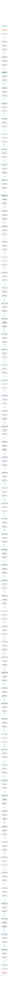

# Kimi K2.6

Moonshot AI's trillion-parameter-class MoE, the largest architecture in this zoo. A DeepSeek-V3-style MLA + fine-grained-MoE design pushed to 384 experts and 256K context, with a vision encoder bolted on in K2.6.

## Model URLs

| Where | URL |
|---|---|
| **Open in Neurarch** (live, editable graph) | https://www.neurarch.com/?import=https://raw.githubusercontent.com/neurarch-ai/neurarch-model-zoo/main/architectures/kimi-k2.6/model.json |
| Hugging Face | https://huggingface.co/moonshotai/Kimi-K2.6 |
| GitHub | https://github.com/MoonshotAI/Kimi-K2 |

## Architecture

| Hyperparameter | Value |
|---|---|
| Type | Decoder-only transformer, sparse MoE (causal LM) |
| Parameters | ~1T total, ~32B active (K2-family dims) |
| Layers | 61 |
| Hidden size | 7168 |
| Attention | Multi-head latent: 64 heads; KV latent 512, Q latent 1536; per head 128 NoPE + 64 RoPE, V 128 |
| FFN | MoE: 384 routed experts, top-8 + 1 shared, expert dim 2,048; first 1 layer dense (18,432) |
| Normalization | RMSNorm, pre-norm |
| Positions | RoPE (rotary dim 64) |
| Vocabulary | 163,840 |
| Max context | 262,144 |

The diagram and `model.json` show the full forward path with one of the 61 decoder blocks expanded (the stack repeats x61). All hyperparameters are taken from the official `config.json` on Hugging Face.

## Design notes

- DeepSeek-V3 lineage scaled out: same 61-layer, 7168-hidden MLA backbone, but 384 routed experts (vs 256), half the attention heads (64), and only the first layer dense.
- The K2 tech report puts the family at roughly 1T total / 32B active parameters; K2.6 keeps those dims per its config.json (hyperparameters here are read from the June 2026 config directly).
- 262144-token context with rope_theta 50000 on the 64-dim decoupled RoPE part.
- The config carries a vision encoder (patch 14) alongside the text stack: K2.6 is natively multimodal. This entry shows the text decoder.

## Files

| File | What it is |
|---|---|
| [`model.json`](model.json) | The Neurarch graph. Shape-validated; open it at [neurarch.com](https://www.neurarch.com/) to edit or export training code. |
| [`assets/diagram.svg`](assets/diagram.svg) | Vector diagram (papers, slides). |
| [`assets/diagram.png`](assets/diagram.png) | Raster diagram (renders everywhere). |

**License:** Modified MIT (K2 family). The graph and diagrams here describe the architecture; the model weights remain under the upstream license.
