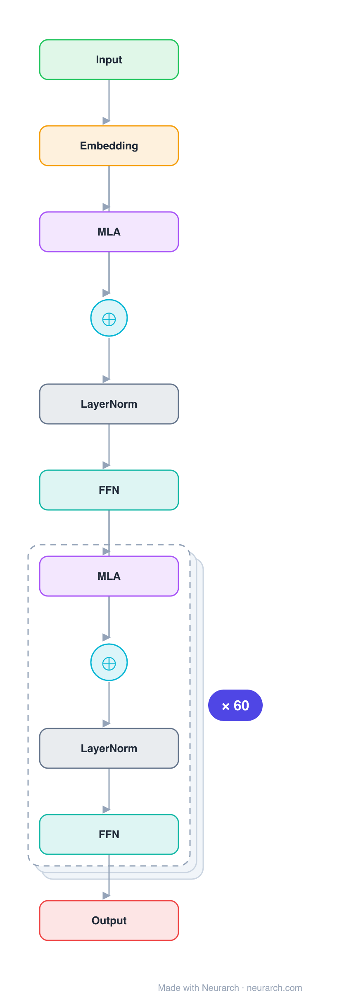

# Kimi K2.6

Moonshot AI's trillion-parameter-class MoE, the largest architecture in this zoo. A DeepSeek-V3-style MLA + fine-grained-MoE design pushed to 384 experts and 256K context, with a vision encoder bolted on in K2.6.

## Model URLs

| Where | URL |
|---|---|
| **Open in Neurarch** (live, editable graph) | https://www.neurarch.com/?import=https://raw.githubusercontent.com/neurarch-ai/neurarch-model-zoo/main/architectures/kimi-k2.6/model.json |
| Hugging Face | https://huggingface.co/moonshotai/Kimi-K2.6 |
| GitHub | https://github.com/MoonshotAI/Kimi-K2 |

## Architecture

*Identical repeated blocks are folded into one representative block with a `× N` badge, so the whole architecture fits on screen. `model.json` keeps all 247 nodes (open it in Neurarch to see and edit every layer). Vector: [diagram.svg](assets/diagram.svg).*

| Hyperparameter | Value |
|---|---|
| Type | Decoder-only transformer, sparse MoE (causal LM) |
| Parameters | ~1.06T total, ~32B active |
| Layers | 61 |
| Hidden size | 7168 |
| Attention | Multi-head latent: 64 heads; KV latent 512, Q latent 1536; per head 128 NoPE + 64 RoPE, V 128 |
| FFN | MoE: 384 routed experts, top-8 + 1 shared, expert dim 2,048; first 1 layer dense (18,432) |
| Normalization | RMSNorm, pre-norm |
| Positions | RoPE (rotary dim 64) |
| Vocabulary | 163,840 |
| Max context | 262,144 |

`model.json` is the full 61-layer graph, produced with the same import path the Neurarch app uses for "load from Hugging Face" (with importer fixes noted in the generator script), with all hyperparameters from the official `config.json`.

## Parameter check

Neurarch's per-layer parameter estimate over this graph: **1.02T**.
Hugging Face safetensors metadata reports **1.06T** for the real weights.
Deviation from the authoritative count (1.06T): **-3.3%**.

> The graph sum lands ~3% under the safetensors total: the always-on shared expert (44M x 60 layers) and MLA's decoupled-RoPE projections are folded into node notes rather than separate nodes.

## Design notes

- DeepSeek-V3 lineage scaled out: same 61-layer, 7168-hidden MLA backbone, but 384 routed experts (vs 256), half the attention heads (64), and only the first layer dense.
- HF safetensors metadata puts the total at 1.06T parameters with roughly 32B active per token.
- 262144-token context with rope_theta 50000 on the 64-dim decoupled RoPE part.
- The config carries a vision encoder (patch 14) alongside the text stack: K2.6 is natively multimodal. This entry shows the text decoder.

## Files

| File | What it is |
|---|---|
| [`model.json`](model.json) | The full Neurarch graph (every layer, real dimensions). Open it at [neurarch.com](https://www.neurarch.com/) to edit or export training code. |
| [`assets/diagram.svg`](assets/diagram.svg) / [`.png`](assets/diagram.png) | Architecture diagram (repeated blocks folded with a `× N` badge). |

**License:** Modified MIT (K2 family). The graph and diagrams here describe the architecture; the model weights remain under the upstream license.
