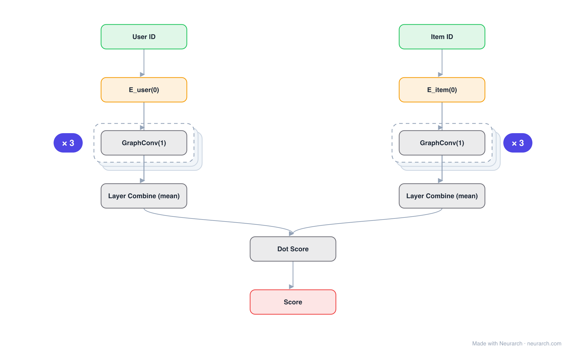

# LightGCN

Graph convolution for collaborative filtering stripped to its minimum: no feature transforms, no nonlinearities, just neighborhood propagation over the user-item graph and a layer-wise average.

## Model URLs

| Where | URL |
|---|---|
| **Open in Neurarch** (live, editable graph) | https://www.neurarch.com/?import=https://raw.githubusercontent.com/neurarch-ai/neurarch-model-zoo/main/architectures/lightgcn/model.json |
| Paper (He et al. 2020) | https://arxiv.org/abs/2002.02126 |
| GitHub | https://github.com/gusye1234/LightGCN-PyTorch |

## Architecture

<b>Layer-by-layer (14 nodes)</b>

| # | Layer | Type | Params |
|---|---|---|---|
| 1 | User ID | `input` | shape: [1] |
| 2 | E_user(0) | `embedding` | vocabSize: 100000, embeddingDim: 64 |
| 3 | GraphConv(1) | `graphConv` | inFeatures: 64, outFeatures: 64, useTransform: false, useNonlinearity: false |
| 4 | GraphConv(2) | `graphConv` | inFeatures: 64, outFeatures: 64, useTransform: false, useNonlinearity: false |
| 5 | GraphConv(3) | `graphConv` | inFeatures: 64, outFeatures: 64, useTransform: false, useNonlinearity: false |
| 6 | Layer Combine (mean) | `mean` | dim: 0, numInputs: 4 |
| 7 | Item ID | `input` | shape: [1] |
| 8 | E_item(0) | `embedding` | vocabSize: 1000000, embeddingDim: 64 |
| 9 | GraphConv(1) | `graphConv` | inFeatures: 64, outFeatures: 64, useTransform: false, useNonlinearity: false |
| 10 | GraphConv(2) | `graphConv` | inFeatures: 64, outFeatures: 64, useTransform: false, useNonlinearity: false |
| 11 | GraphConv(3) | `graphConv` | inFeatures: 64, outFeatures: 64, useTransform: false, useNonlinearity: false |
| 12 | Layer Combine (mean) | `mean` | dim: 0, numInputs: 4 |
| 13 | Dot Score | `matmul` |   |
| 14 | Score | `output` |   |

This graph ships in Neurarch's in-app template library; the copy here passes shape propagation with zero errors.

## Design notes

- An ablation result turned architecture: removing the transforms and activations from NGCF improved accuracy.
- Final embeddings average over propagation layers (layer combination), capturing multi-hop signals at different ranges.

## Files

| File | What it is |
|---|---|
| [`model.json`](model.json) | The Neurarch graph. Shape-validated; open it at [neurarch.com](https://www.neurarch.com/) to edit or export training code. |
| [`assets/diagram.svg`](assets/diagram.svg) | Vector diagram (papers, slides). |
| [`assets/diagram.png`](assets/diagram.png) | Raster diagram (renders everywhere). |
