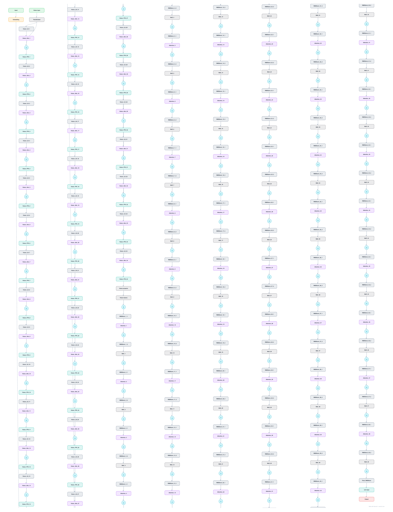
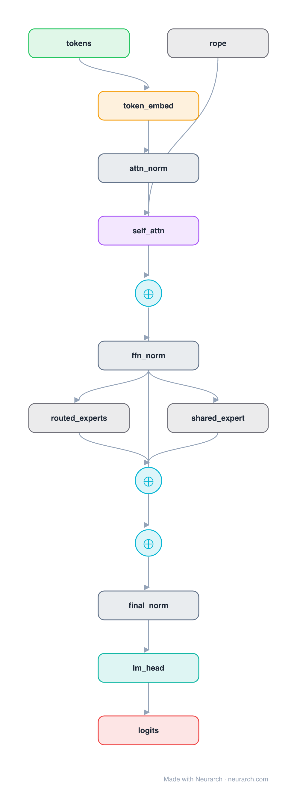

# Llama 4 Scout

Meta's first MoE and first 10M-context model. Architecturally the interesting bits are top-1 routing over 16 fat experts and iRoPE's position-free layers; reception was mixed, but the design choices are worth studying.

## Model URLs

| Where | URL |
|---|---|
| **Open in Neurarch** (live, editable graph) | https://www.neurarch.com/?import=https://raw.githubusercontent.com/neurarch-ai/neurarch-model-zoo/main/architectures/llama-4-scout/model.json |
| Hugging Face | https://huggingface.co/meta-llama/Llama-4-Scout-17B-16E |
| GitHub | https://github.com/meta-llama/llama-models |

## Architecture

*The full graph, all 434 nodes, tiled into columns for readability (read each column top-to-bottom, then left-to-right). Exactly what `model.json` holds. Vector: [diagram.svg](assets/diagram.svg).*

<b>One block, expanded (explainer view)</b>

| Hyperparameter | Value |
|---|---|
| Type | Decoder-only transformer, sparse MoE (causal LM) |
| Parameters | 109B total, 17B active |
| Layers | 48 |
| Hidden size | 5120 |
| Attention | Grouped-query: 40 query heads, 8 KV heads |
| Head dim | 128 |
| FFN | MoE: 16 routed experts, top-1 + 1 shared, expert dim 8,192 |
| Normalization | RMSNorm, pre-norm |
| Positions | iRoPE: RoPE on 36 of 48 layers, every 4th layer position-free (NoPE) |
| Vocabulary | 202,048 |
| Max context | 10,485,760 |

`model.json` is the full 48-layer graph, produced with the same import path the Neurarch app uses for "load from Hugging Face", with all hyperparameters from the official `config.json`.

## Parameter check

Neurarch's per-layer parameter estimate over this graph: **102.55B**.
Hugging Face safetensors metadata reports **108.64B** for the real weights.
Deviation from the authoritative count (108.64B): **-5.6%**.

> The graph sum lands ~6% under the safetensors total, which includes the 34-layer vision tower this text-stack entry omits.

## Design notes

- Coarse MoE, the opposite of DeepSeek's recipe: 16 large experts with top-1 routing plus a shared expert, in every layer (interleave step 1).
- iRoPE for the 10M-token context claim: interleaved layers drop positional encoding entirely (12 of 48 are NoPE, verified from config), betting that attention-only layers generalize past the trained length.
- GQA 40:8 at 5120 hidden; 202048-token vocabulary; natively multimodal (a 34-layer vision tower feeds the same decoder; this entry shows the text stack).
- Hyperparameters verified via the unsloth mirror of the config (the meta-llama repo is gated).

## Files

| File | What it is |
|---|---|
| [`model.json`](model.json) | The full Neurarch graph (every layer, real dimensions). Open it at [neurarch.com](https://www.neurarch.com/) to edit or export training code. |
| [`assets/diagram.svg`](assets/diagram.svg) / [`.png`](assets/diagram.png) | Diagram of the full graph. |
| [`assets/block.svg`](assets/block.svg) / [`.png`](assets/block.png) | Compact one-block explainer view. |

**License:** Llama 4 Community License. The graph and diagrams here describe the architecture; the model weights remain under the upstream license.
